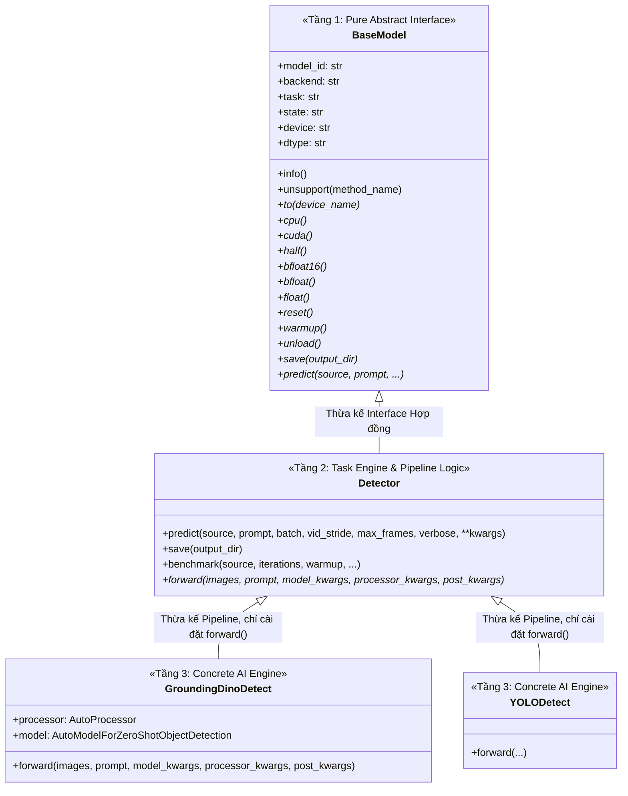
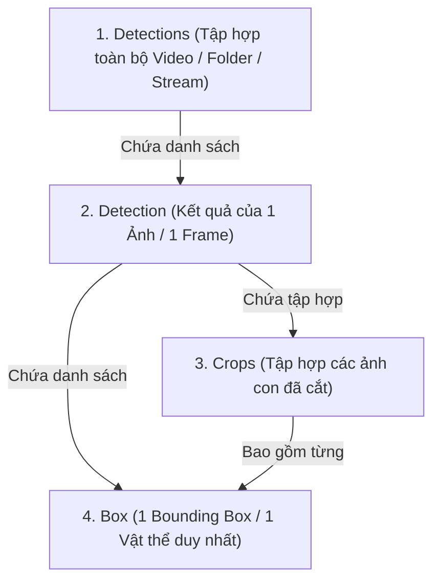

# 📘 TÀI LIỆU KIẾN TRÚC TOÀN DIỆN: DETECTION & 4 LỚP KẾT QUẢ ĐẦU RA (`klygo.models` & `klygo.outputs.detect`)

Tài liệu này đóng vai trò là **Đặc tả Kỹ thuật Chuẩn (Technical Specification & Architecture Reference)** giúp bất kỳ nhà phát triển hoặc mô hình AI nào cũng có thể hiểu thấu đáo 100% về kiến trúc phân tầng nhận diện đối tượng và hệ thống 4 lớp đầu ra bất biến của Klygo.

---

# PHẦN 1: KIẾN TRÚC NHẬN DIỆN ĐỐI TƯỢNG PHÂN TẦNG 3 LỚP

Hệ sinh thái `klygo.models` được thiết kế tuân thủ nghiêm ngặt nguyên lý SOLID, tách bạch hoàn toàn giữa **Interface Hợp đồng (Tầng 1)**, **Nghiệp vụ Xử lý Pipeline (Tầng 2)** và **Động cơ Suy luận AI Thuần túy (Tầng 3)**.



---

## 1.1. Tầng 1: `BaseModel` (`klygo.models.base.BaseModel`)
* **Vai trò**: Là lớp trừu tượng cơ sở thuần túy (Pure Abstract Base Class) định nghĩa bộ hợp đồng chung cho tất cả các bài toán AI trong hệ sinh thái Klygo (Detection, Segmentation, Classification, OCR, Pose).
* **Trách nhiệm**:
  * **Quản lý Định danh & Trạng thái**: `model_id`, `backend`, `task`, `config`, `state` (`READY`, `MODIFIED`, `UNLOADED`).
  * **Hợp đồng Thiết bị & Độ chính xác**: `device`, `dtype`, `to()`, `cpu()`, `cuda()`, `half()`, `bfloat16()`, `bfloat()`, `float()`.
  * **Hợp đồng Vòng đời & Bộ nhớ**: `reset()`, `warmup()`, `clear_cache()`, `unload()`.
  * **Hợp đồng Ngoại lệ & Chặn phương thức**: Khai báo danh sách cấm `__UNSUPPORTED__` và hàm runtime `unsupport(method_name)`. Khi người dùng gọi một hàm không được hỗ trợ (ví dụ `model.train()` trên mô hình chỉ suy luận), hệ thống lập tức ném ra `UnsupportedOperationError`.

---

## 1.2. Tầng 2: `Detector` (`klygo.models.detection.base.Detector`)
* **Vai trò**: Lớp trừu tượng chuyên biệt cho bài toán Nhận diện Đối tượng (Object Detection), kế thừa `BaseModel`.
* **Trách nhiệm (Chứa 100% Business Logic chung)**:
  1. **Tự động phân giải Media (`klygo.media`)**: Nhận diện mọi kiểu đầu vào (`str`, `Path`, `PIL.Image`, `np.ndarray` 2D/3D/4D, `torch.Tensor`, `List`) và chuyển đổi 100% thành `PIL.Image.Image (RGB)`.
  2. **Tự động chia Batch & Xử lý Video**: Tự động áp dụng bước nhảy khung hình `vid_stride`, giới hạn số khung `max_frames` và gom ảnh theo kích thước `batch`.
  3. **Bộ định tuyến Tham số Chống trùng lặp 3 Dạng (Zero-Collision Routing)**:
     * **Dạng 1 (Tên chuẩn gốc)**: Trùng tên trong `config.json` gốc $\to$ Ghi đè tự nhiên.
     * **Dạng 2 (Tiền tố kẹp 2 đầu PEP 8)**: `model_<param>_`, `processor_<param>_`, `post_<param>_` $\to$ Chống trùng lặp tuyệt đối.
     * **Dạng 3 (Khối Dictionary tường minh)**: `model={...}`, `processor={...}`, `post={...}`.
  4. **Đo đạc Benchmark & Tốc độ**: Tự động đo thời gian suy luận, tính toán `latency_ms` và `fps` gắn trực tiếp vào đầu ra.
  5. **Đóng gói Mô hình Offline (`model.save(output_dir)`)**: Tự động xuất weights kèm file định danh `klygo.json` để chạy offline không cần Internet.
  6. **Định nghĩa hàm trừu tượng duy nhất**: `forward(images, prompt, model_kwargs, processor_kwargs, post_kwargs)`.

---

## 1.3. Tầng 3: Các Mô hình Cụ thể (`GroundingDinoDetect`, `YOLODetect`, ...)
* **Vai trò**: Động cơ suy luận AI thuần túy (Pure Inference Engines).
* **Trách nhiệm**: Lớp con **chỉ cần hiện thực duy nhất 1 hàm `forward()`** nhận 3 gói kwargs đã được Tầng 2 bóc tách sạch sẽ:
  * `processor_kwargs`: Tham số cho bộ tiền xử lý hình ảnh/văn bản.
  * `model_kwargs`: Tham số truyền thẳng vào mạng nơ-ron.
  * `post_kwargs`: Tham số lọc ngưỡng hậu xử lý (`threshold`, `text_threshold`, `nms_iou`).

---

# PHẦN 2: HỆ THỐNG 4 LỚP KẾT QUẢ ĐẦU RA BẤT BIẾN (`klygo.outputs.detect`)

Hệ thống kết quả đầu ra được tổ chức thành 4 cấp độ từ hạt nhân đến toàn cục, đảm bảo tính nhất quán tuyệt đối giữa việc lập trình hướng đối tượng, truy xuất theo chỉ số (Indexing/Slicing) và trích xuất dữ liệu.



---

## 2.1. Đẳng thức Truy xuất Đồng nhất (The Unified Indexing Identity)

Tại bất kỳ đâu trong hệ thống, đẳng thức truy xuất sau luôn đúng 100%:

$$\texttt{detections[0][0]} \equiv \texttt{detection[0]} \equiv \texttt{crops[0]} \equiv \texttt{box}$$

---

## 2.2. Chi tiết Lớp 1: `Box` (Cấp Hạt Nhân - 1 Vật thể Duy nhất)

`Box` đại diện cho một Bounding Box duy nhất được tìm thấy, gắn liền với ảnh gốc của nó.

### Thuộc tính cốt lõi (Core Properties):
* `id` (`int`): ID thứ tự của vật thể trong ảnh (0, 1, 2, ...).
* `label` (`str`): Tên nhãn lớp của vật thể (ví dụ: `"cat"`, `"person"`).
* `score` (`float`): Độ tin cậy nhận diện từ $0.0 \to 1.0$.
* `box` (`List[float]`): Tọa độ hộp bao pixel dạng chuẩn `[xmin, ymin, xmax, ymax]`.
* `parent_image` (`Optional[PIL.Image.Image]`): Tham chiếu tới ảnh gốc chứa vật thể này.
* `pad` (`int`): Độ đệm pixel mở rộng khi cắt ảnh con.

### Hình học & Tọa độ phái sinh (Geometry Engine):
* `xmin`, `ymin`, `xmax`, `ymax` (`float`): Tọa độ 4 cạnh của hộp bao.
* `width` (`float`): Chiều rộng pixel ($xmax - xmin$).
* `height` (`float`): Chiều cao pixel ($ymax - ymin$).
* `area` (`float`): Diện tích pixel ($width \times height$).
* `aspect_ratio` (`float`): Tỉ lệ khung hình ($width / height$).
* `center_x`, `center_y` (`float`): Tọa độ tâm của vật thể.
* `center` (`Tuple[float, float]`): Điểm tâm $(center\_x, center\_y)$.
* `corners` (`List[Tuple[float, float]]`): Tọa độ 4 đỉnh hộp bao: Top-Left, Top-Right, Bottom-Right, Bottom-Left.

### Các định dạng biểu diễn BBox (Coordinate Formats):
* `xyxy` $\to$ `[xmin, ymin, xmax, ymax]` (Pixel).
* `xywh` $\to$ `[xmin, ymin, width, height]` (Pixel).
* `cxcywh` $\to$ `[center_x, center_y, width, height]` (Pixel).
* `xyxyn` $\to$ Tọa độ chuẩn hóa tỉ lệ $[0.0, 1.0]$ trên kích thước ảnh gốc.
* `xywhn` $\to$ Tọa độ chuẩn hóa dạng `[xmin_norm, ymin_norm, width_norm, height_norm]`.

### Toán tử & Thao tác Hình học (Transformations):
* `image` $\to$ **Lazy Cropping**: Tự động trích xuất ảnh con `PIL.Image.Image` đúng kích thước vật thể từ ảnh mẹ (kèm độ đệm `pad`).
* `crop(pad=0)` $\to$ Trả về ảnh con `PIL.Image.Image`.
* `scale(sx, sy)` $\to$ Nhân tỉ lệ kích thước BBox.
* `shift(dx, dy)` $\to$ Dịch chuyển tọa độ BBox.
* `pad_box(pixels)` $\to$ Mở rộng biên độ hộp bao.
* `clamp(width, height)` $\to$ Khống chế tọa độ không vượt khỏi biên ảnh.
* `iou(other_box)` $\to$ Tính chỉ số Intersection over Union (IoU) với một Box khác.
* `to_dict()` $\to$ Chuyển thành Dictionary: `{"id": ..., "label": ..., "score": ..., "box": [...]}`.
* `save(path)` $\to$ Lưu trực tiếp ảnh con đã cắt xuống đĩa cứng thông qua `klygo.files`.
* `show()` $\to$ Hiển thị trực tiếp ảnh con vật thể.

---

## 2.3. Chi tiết Lớp 2: `Crops` (Tập hợp các Ảnh Con đã Cắt)

`Crops` đóng vai trò là một container chuyên biệt quản lý toàn bộ các ảnh con của một lần nhận diện.

### Khả năng & Tính năng:
* **Hỗ trợ Indexing & Iteration**: `crops[i]` trả về đối tượng `Box` thứ `i`. `for box in crops:` duyệt tuần tự từng vật thể.
* `len(crops)` $\to$ Tổng số lượng ảnh con / vật thể.
* `images` $\to$ Trả về danh sách `List[PIL.Image.Image]` của toàn bộ các ảnh con.
* `save(output_dir, prefix="crop")` $\to$ Tự động lưu toàn bộ các ảnh con ra thư mục chỉ định bằng `klygo.files.save` theo quy tắc `{prefix}_{index}_{label}_{score}.jpg`.
* `show()` $\to$ Hiển thị lưới hình ảnh toàn bộ các ảnh con cùng lúc.
* `to_pil()` $\to$ Danh sách `List[PIL.Image.Image]`.
* `to_numpy()` $\to$ Danh sách `List[np.ndarray]`.
* `to_base64()` $\to$ Danh sách chuỗi mã hóa Base64 cho từng ảnh con (phục vụ truyền dữ liệu API/Web).

---

## 2.4. Chi tiết Lớp 3: `Detection` (Kết quả của 1 Ảnh / 1 Frame Đơn Lẻ)

`Detection` là cấu trúc trung tâm đại diện cho toàn bộ kết quả phân tích trên **một bức ảnh hoặc một khung hình video**.

### Thuộc tính cốt lõi:
* `boxes` (`List[Box]`): Danh sách toàn bộ các đối tượng `Box` được phát hiện.
* `orig_img` (`Optional[PIL.Image.Image]`): Ảnh gốc ban đầu.
* `source_name` (`str`): Tên định danh nguồn (đường dẫn file, index camera, v.v.).
* `speed` (`Dict[str, float]`): Thống kê hiệu năng: `{"latency_ms": ..., "fps": ...}`.
* `extra_data` (`Dict[str, Any]`): Dữ liệu siêu thông tin mở rộng.

### Thuộc tính phái sinh tiện ích (Ergonomic Aliases):
* `crops` $\to$ Trả về đối tượng `Crops` của frame này.
* `labels` $\to$ `List[str]` danh sách tất cả các nhãn (ví dụ: `["cat", "dog"]`).
* `scores` $\to$ `List[float]` danh sách tất cả điểm tin cậy.
* `xyxy` $\to$ `List[List[float]]` danh sách tọa độ pixel dạng `[[x1,y1,x2,y2], ...]`.
* `xywh` $\to$ `List[List[float]]` danh sách tọa độ pixel dạng `[[x,y,w,h], ...]`.
* `unique_labels` $\to$ Tập hợp các nhãn duy nhất không trùng lặp `List[str]`.
* `class_counts` $\to$ Thống kê số lượng theo từng nhãn: `{"cat": 2, "person": 5}`.

### Bộ lọc dữ liệu mạnh mẽ (Filtering Engine):
* `filter_by_confidence(min_score)` $\to$ Trả về đối tượng `Detection` mới chỉ chứa các vật thể có `score >= min_score`.
* `filter_by_class(labels)` $\to$ Trả về đối tượng `Detection` mới chỉ chứa các lớp được chỉ định.
* `filter_by_area(min_area, max_area)` $\to$ Lọc vật thể theo diện tích pixel.
* `filter(predicate: Callable[[Box], bool])` $\to$ Lọc vật thể theo hàm điều kiện tùy biến.

### Trực quan hóa & Xuất dữ liệu:
* `plot(conf=True, labels=True, line_width=2)` $\to$ Vẽ Bounding Box và nhãn lên ảnh gốc thông qua `klygo.visual`, trả về `PIL.Image.Image`.
* `show()` $\to$ Hiển thị trực tiếp ảnh đã vẽ BBox.
* `save(output_path)` $\to$ Lưu ảnh đã vẽ BBox xuống đĩa qua `klygo.files`.
* `to_dict()` $\to$ Trả về Dictionary đầy đủ gồm danh sách objects, speed, image dimensions.
* `to_json()` $\to$ Trả về chuỗi JSON chuẩn hóa.
* `to_dataframe()` $\to$ Chuyển đổi toàn bộ kết quả thành Pandas DataFrame (nếu có cài `pandas`).
* `export_yolo(txt_path)` $\to$ Xuất file nhãn chuẩn định dạng YOLO format (`class_id x_center y_center width height`).

---

## 2.5. Chi tiết Lớp 4: `Detections` (Tập hợp Kết quả Toàn bộ Video / Folder / Batch)

`Detections` là lớp bao bọc cao nhất, đại diện cho kết quả của một chuỗi nhiều ảnh, một batch lớn, hoặc toàn bộ một file video.

### Thuộc tính cốt lõi:
* `frames` (`List[Detection]`): Danh sách các đối tượng `Detection` theo từng frame/ảnh.
* `source_type` (`str`): Kiểu nguồn (`"image"`, `"video"`, `"batch"`, `"stream"`).
* `fps` (`float`): Tốc độ khung hình gốc của video.
* `created_at` (`str`): Thời gian khởi tạo kết quả ISO-8601.

### Thống kê & Tổng hợp Toàn cục (Global Analytics):
* `total_objects` $\to$ Tổng số vật thể tìm thấy trên toàn bộ video / batch.
* `total_frames` $\to$ Tổng số khung hình đã xử lý (`len(detections)`).
* `unique_labels` $\to$ Toàn bộ các nhãn xuất hiện trong toàn bộ video.
* `class_counts` $\to$ Tổng số lượng từng loại vật thể trên toàn bộ video: `{"car": 120, "person": 45}`.
* `mean_speed` $\to$ Độ trễ trung bình và FPS trung bình trên toàn bộ các frame.
* `total_time_ms` $\to$ Tổng thời gian tính toán của toàn bộ pipeline.

### Truy xuất đa chiều (Multi-Dimensional Indexing):
* `detections[i]` $\to$ Trả về `Detection` thứ `i`.
* `detections[i][j]` $\to$ Trả về `Box` thứ `j` trong frame thứ `i`.
* `detections[i:k]` $\to$ Cắt lát (Slicing) trả về đối tượng `Detections` mới chứa tập con các frames.
* `for det in detections:` $\to$ Duyệt tuần tự từng frame.

### Đóng gói & Xuất dữ liệu quy mô lớn:
* `save_crops(output_dir)` $\to$ Tự động cắt và lưu toàn bộ ảnh con của TẤT CẢ các frame vào thư mục.
* `save_images(output_dir)` $\to$ Vẽ BBox và lưu toàn bộ các frame ảnh đã nhận diện vào thư mục.
* `export_coco(json_path)` $\to$ Xuất toàn bộ kết quả video/folder thành file Annotation chuẩn định dạng **COCO JSON Format**.
* `export_yolo(output_dir)` $\to$ Xuất toàn bộ annotations thành các file `.txt` chuẩn YOLO.
* `to_dataframe()` $\to$ Gộp toàn bộ kết quả của tất cả các frame thành 1 bảng DataFrame hoàn chỉnh gồm cả `frame_id`.

---

# PHẦN 3: HƯỚNG DẪN TÍCH HỢP MÔ HÌNH MỚI (GUIDE FOR NEW MODELS)

Để thêm một mô hình nhận diện đối tượng mới (ví dụ: `YOLODetect`, `Owlv2Detect`, `FlorenceDetect`) vào `klygo.models.detection`, nhà phát triển chỉ cần làm theo **3 bước chuẩn hóa**:

### Bước 1: Kế thừa `Detector`
```python
from typing import List, Dict, Any
import PIL.Image
from klygo.models.detection.base import Detector
from klygo.outputs.detect import Detection, Box

class MyCustomDetect(Detector):
    def __init__(self, metadata: Dict[str, Any], **kwargs) -> None:
        super().__init__(
            metadata=metadata,
            unsupported=("train", "val"),  # Khai báo các method không hỗ trợ
            **kwargs,
        )
        # Nạp weights mô hình vào self.model
```

### Bước 2: Cài đặt phương thức `forward()`
```python
    def forward(
        self,
        images: List[PIL.Image.Image],
        prompt: List[str],
        model_kwargs: Dict[str, Any],
        processor_kwargs: Dict[str, Any],
        post_kwargs: Dict[str, Any],
    ) -> List[Detection]:
        results: List[Detection] = []
        
        for img in images:
            # 1. Chạy suy luận qua self.model
            # 2. Tạo danh sách các Box:
            boxes = [
                Box(
                    id=idx,
                    label=pred_label,
                    score=pred_conf,
                    box=[xmin, ymin, xmax, ymax],
                    parent_image=img,
                )
                for idx, (pred_label, pred_conf, (xmin, ymin, xmax, ymax)) in enumerate(...)
            ]
            
            # 3. Đóng gói vào đối tượng Detection
            results.append(Detection(boxes=boxes, orig_img=img))
            
        return results
```

### Bước 3: Đăng ký vào Registry (`klygo/models/registry.json`)
```json
{
  "my-custom-model": {
    "class": "klygo.models.detection.my_custom.MyCustomDetect",
    "backend": "Custom",
    "task": "Object-Detection",
    "config": {
      "model": {},
      "processor": {},
      "post": {
        "threshold": 0.25
      }
    }
  }
}
```

Ngay sau khi đăng ký:
* `models.load("my-custom-model")` sẽ tự động hoạt động.
* Tự động thừa hưởng toàn bộ: Batching, Video Slicing, Multi-GPU, FP16/BFLOAT16, Benchmark, 3 Dạng Sub-Kwargs, và Cấu trúc Đầu ra 4 Lớp `Detections` bất biến.

---
*(Tài liệu này là đặc tả kỹ thuật chính thức của Klygo Deep Learning Framework).*
