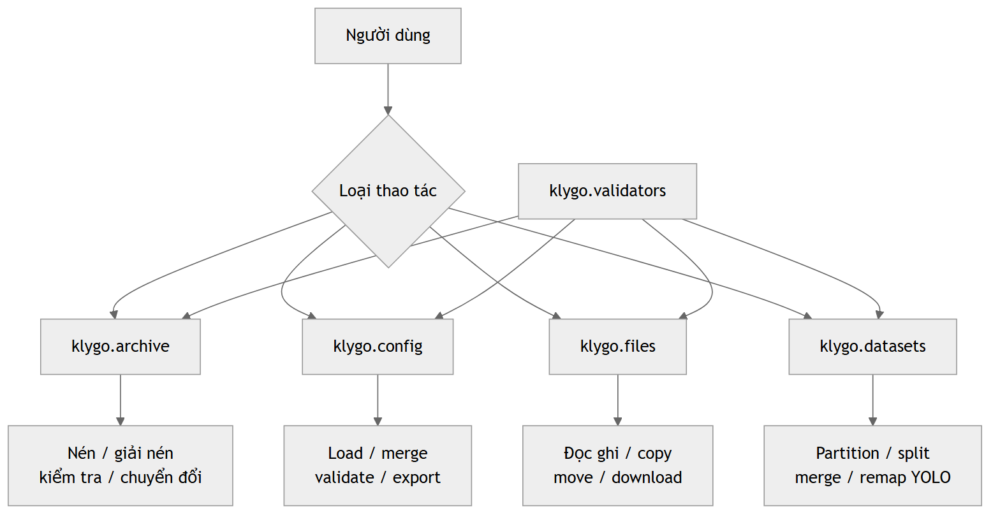
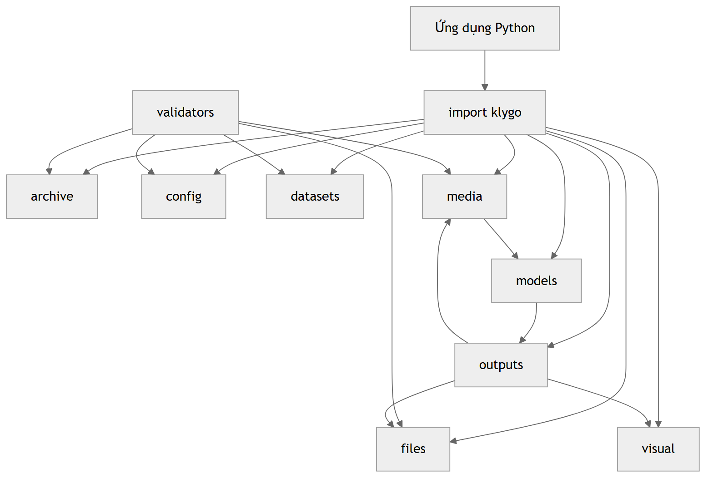
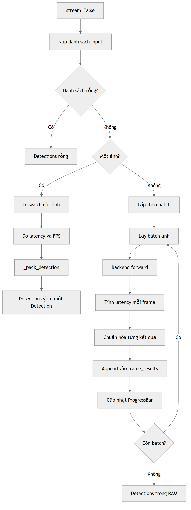
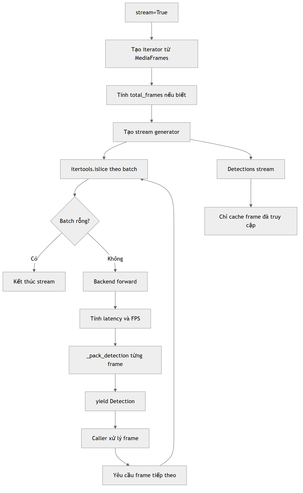
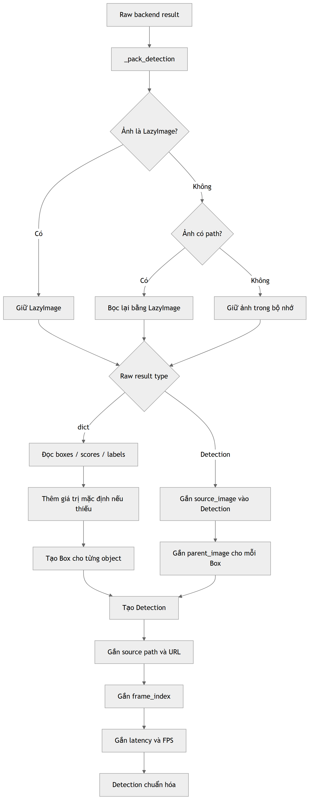
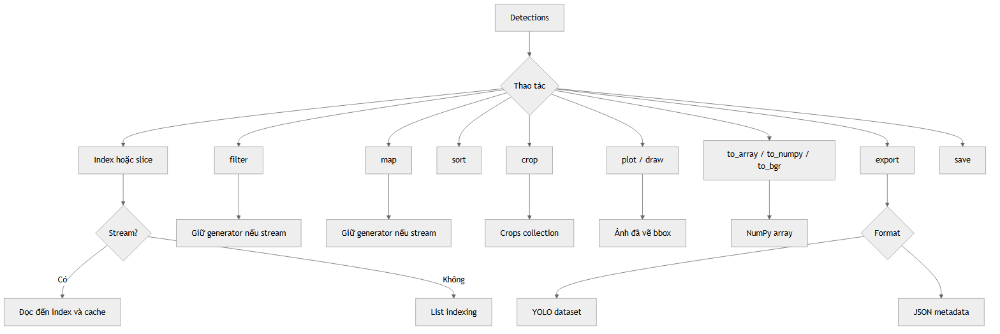
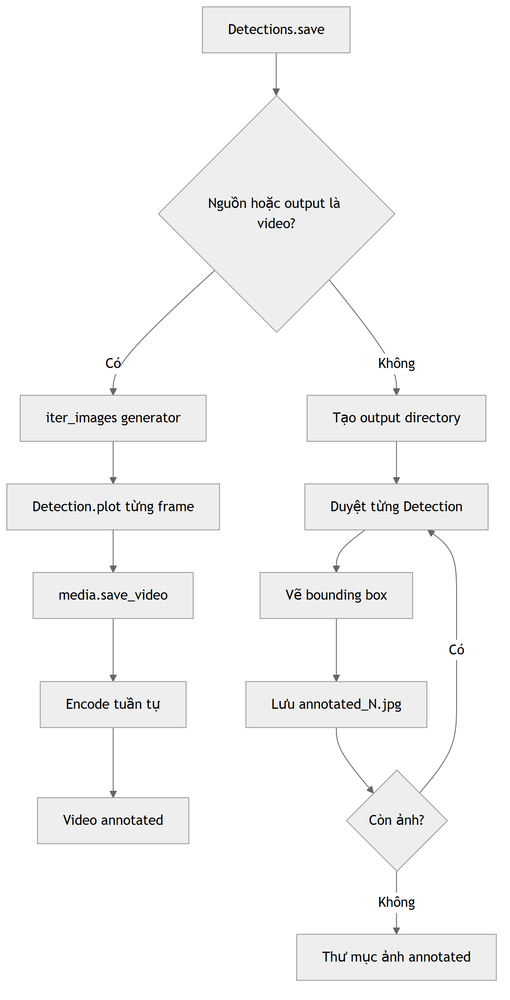
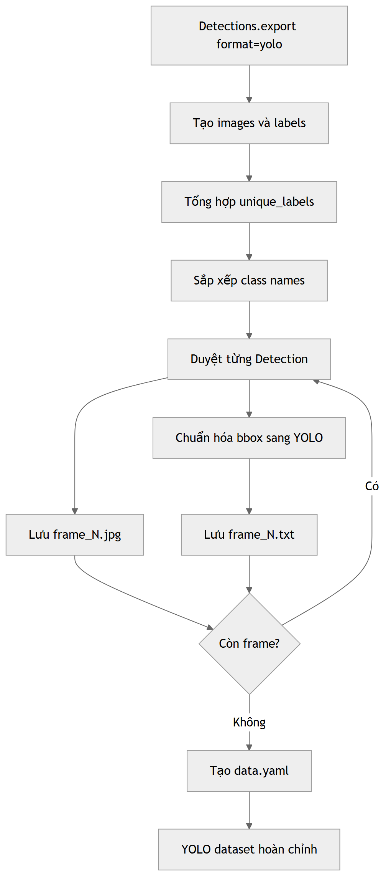

# Klygo workflow diagrams

## 01. Tổng quan hệ thống

## 02. Data và I/O

## 03. Media pipeline

## 04. Model loading

## 05. Prediction pipeline

## 06. Output workflow

## 07. Streaming video

## 08. Luồng module chi tiết

## 09. Xác định nguồn media

## 10. LazyImage và Zero-RAM

## 11. Nạp model chi tiết

## 12. Chuẩn bị prediction

## 13. Prediction chế độ thường

## 14. Prediction streaming

## 15. Backend inference

## 16. Chuẩn hóa kết quả

## 17. Cấu trúc output

## 18. Xử lý Detections

## 19. Lưu kết quả

## 20. Export YOLO dataset

## 21. Archive workflow

## 22. Dataset workflow

