# Bản đồ workflow và kiến trúc Klygo

Thư mục này mô tả luồng hoạt động của repository `klygo` từ lúc ứng dụng gọi API, đọc dữ liệu, nạp model, chạy inference đến khi lưu hoặc export kết quả.

## Thứ tự đọc đề xuất

1. **Định hướng kiến trúc:** ảnh 01–03.
2. **Chuẩn bị dữ liệu:** ảnh 04–06.
3. **Đọc ảnh và video:** ảnh 07–10.
4. **Nạp và thực thi model:** ảnh 11–18.
5. **Sử dụng kết quả:** ảnh 19–23.

## Mapping nhanh

| Ảnh | Nội dung | Hoạt động chính ở | Ứng dụng |
|---:|---|---|---|
| 01 | Tổng quan hệ thống | `klygo/__init__.py` | Nhìn toàn bộ đường đi của dữ liệu |
| 02 | Bản đồ module | Các package dưới `klygo/` | Chọn đúng public API |
| 03 | Kế thừa class model | `klygo/models`, `outputs`, `media` | Hiểu hoặc mở rộng model mới |
| 04 | Data và I/O | `archive`, `config`, `files`, `datasets` | Chuẩn bị dữ liệu trước inference |
| 05 | Archive workflow | `klygo/archive` | Nén, giải nén, kiểm tra dataset |
| 06 | Dataset workflow | `klygo/datasets` | Chuẩn hóa dataset YOLO |
| 07 | Media pipeline | `klygo/media/operations.py` | Đưa ảnh/video vào hệ thống |
| 08 | Resolve nguồn media | `media.load()` | Kiểm tra path, loại file và lỗi input |
| 09 | LazyImage Zero-RAM | `LazyImage`, `VideoReader` | Xử lý video lớn mà không đầy RAM |
| 10 | Streaming video | `MediaFrames`, `Detections` | Pipeline tuần tự theo frame |
| 11 | Model loading tổng quan | `models.load()` | Nạp model registry, offline hoặc custom |
| 12 | Model loading chi tiết | `models/load.py` | Theo dõi quá trình resolve class/config |
| 13 | Chuẩn bị prediction | `Detector.predict()` | Chuẩn hóa prompt, batch và source |
| 14 | Backend inference | `models/backend`, concrete detector | Gọi Hugging Face hoặc Ultralytics |
| 15 | Prediction tổng quan | `Detector.predict/forward` | Hiểu pipeline inference đầu-cuối |
| 16 | Prediction thường | `stream=False` | Dataset nhỏ, cần toàn bộ kết quả ngay |
| 17 | Prediction streaming | `stream=True` | Video dài, xử lý tuần tự |
| 18 | Chuẩn hóa kết quả | `Detector._pack_detection()` | Hợp nhất output nhiều backend |
| 19 | Cấu trúc output | `klygo/outputs/detect.py` | Hiểu `Detections`, `Detection`, `Box` |
| 20 | Output workflow | `Detections` | Chọn vẽ, crop, lưu hay export |
| 21 | Các phép xử lý output | `Detections` methods | Filter, map, sort và chuyển array |
| 22 | Lưu kết quả | `Detections.save()` | Sinh ảnh hoặc video annotated |
| 23 | Export YOLO | `Detections.export()` | Tạo dataset để train/retrain |

---

## 01. Tổng quan hệ thống

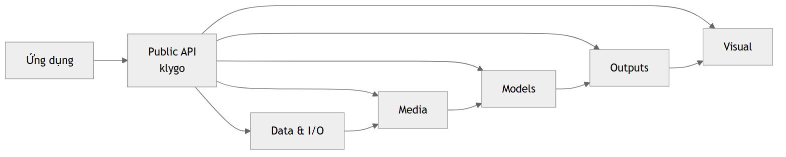

- **Chạy ở:** public API được tập hợp tại [`klygo/__init__.py`](../../klygo/__init__.py).
- **Vai trò:** cho thấy chuỗi chính `Data & I/O → Media → Models → Outputs → Visual`.
- **Đầu vào:** lời gọi từ ứng dụng Python.
- **Đầu ra:** dữ liệu đã xử lý, kết quả nhận diện hoặc ảnh/video trực quan.
- **Dùng khi:** cần giải thích Klygo làm gì mà chưa đi vào implementation.
- **Đọc tiếp:** ảnh 02 để biết module nào chịu trách nhiệm cho từng bước.

## 02. Bản đồ module

- **Chạy ở:** các package `archive`, `config`, `files`, `datasets`, `media`, `models`, `outputs`, `visual`.
- **Vai trò:** mapping public API với subsystem bên dưới.
- **Ứng dụng:** giúp developer xác định nơi cần sửa khi thêm tính năng hoặc điều tra lỗi.
- **Quan hệ chính:** `validators` kiểm tra input; `media` cấp dữ liệu cho `models`; `outputs` dùng lại `media`, `files` và `visual`.
- **Đọc tiếp:** ảnh 03 để hiểu class model được phân tầng thế nào.

## 03. Kiến trúc tầng class model

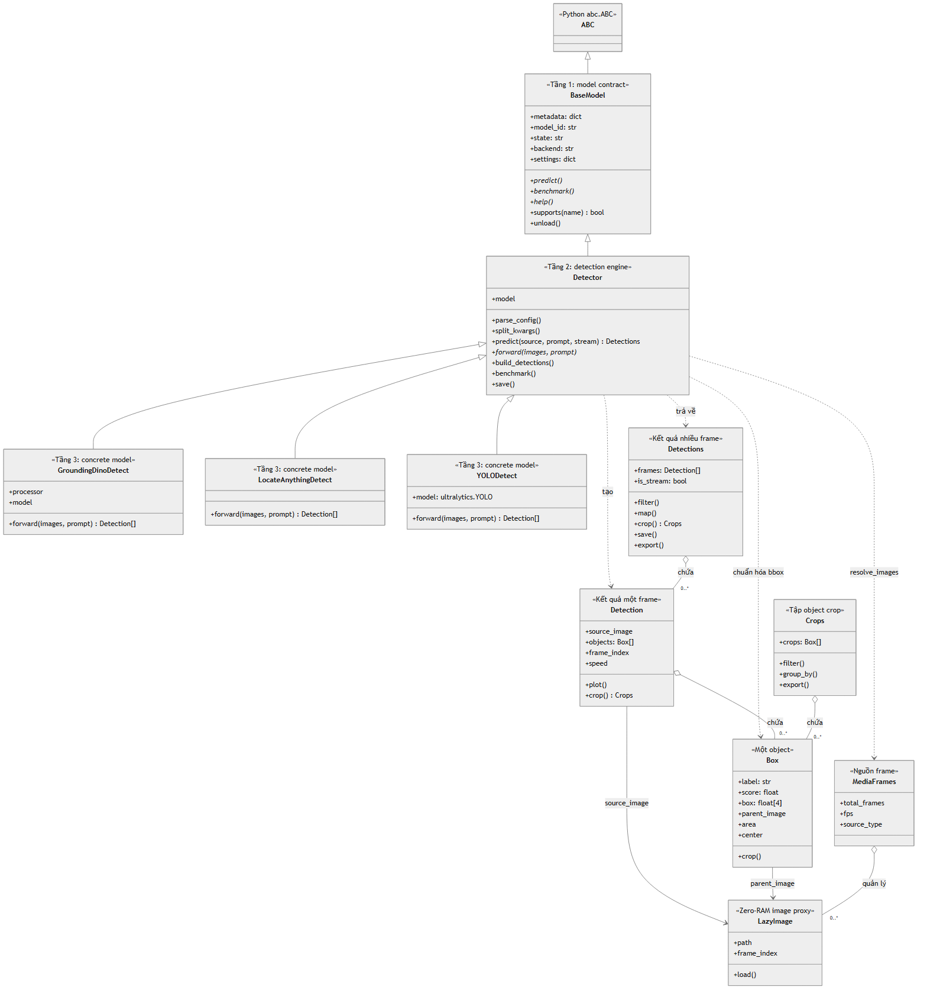

- **Tầng 1 – `BaseModel`:** contract chung, metadata, settings, trạng thái và guard unsupported operation.
- **Tầng 2 – `Detector`:** engine dùng chung cho object detection, batching, streaming, benchmark và đóng gói kết quả.
- **Tầng 3 – concrete detectors:** `GroundingDinoDetect`, `LocateAnythingDetect`, `YOLODetect` chỉ triển khai phần đặc thù model/processor và `forward()`.
- **Output composition:** một `Detections` chứa nhiều `Detection`; mỗi `Detection` chứa nhiều `Box`; `Crops` cũng quản lý các `Box` đã crop.
- **Media mapping:** `MediaFrames` quản lý các `LazyImage`; `Detection.source_image` và `Box.parent_image` giữ liên kết tới ảnh nguồn.
- **Dùng khi:** thêm model mới, thay backend hoặc cần hiểu class nào sở hữu logic nào.

---

## 04. Data và I/O

- **Chạy ở:** [`klygo/archive`](../../klygo/archive), [`klygo/config`](../../klygo/config), [`klygo/files`](../../klygo/files), [`klygo/datasets`](../../klygo/datasets).
- **Vai trò:** xử lý dữ liệu trước khi đưa vào media/model pipeline.
- **Ứng dụng:** giải nén dataset, đọc cấu hình, di chuyển file và chia dataset train/val/test.
- **Đầu ra:** đường dẫn, config hoặc dataset đã chuẩn hóa để `media.load()` sử dụng.

## 05. Archive workflow

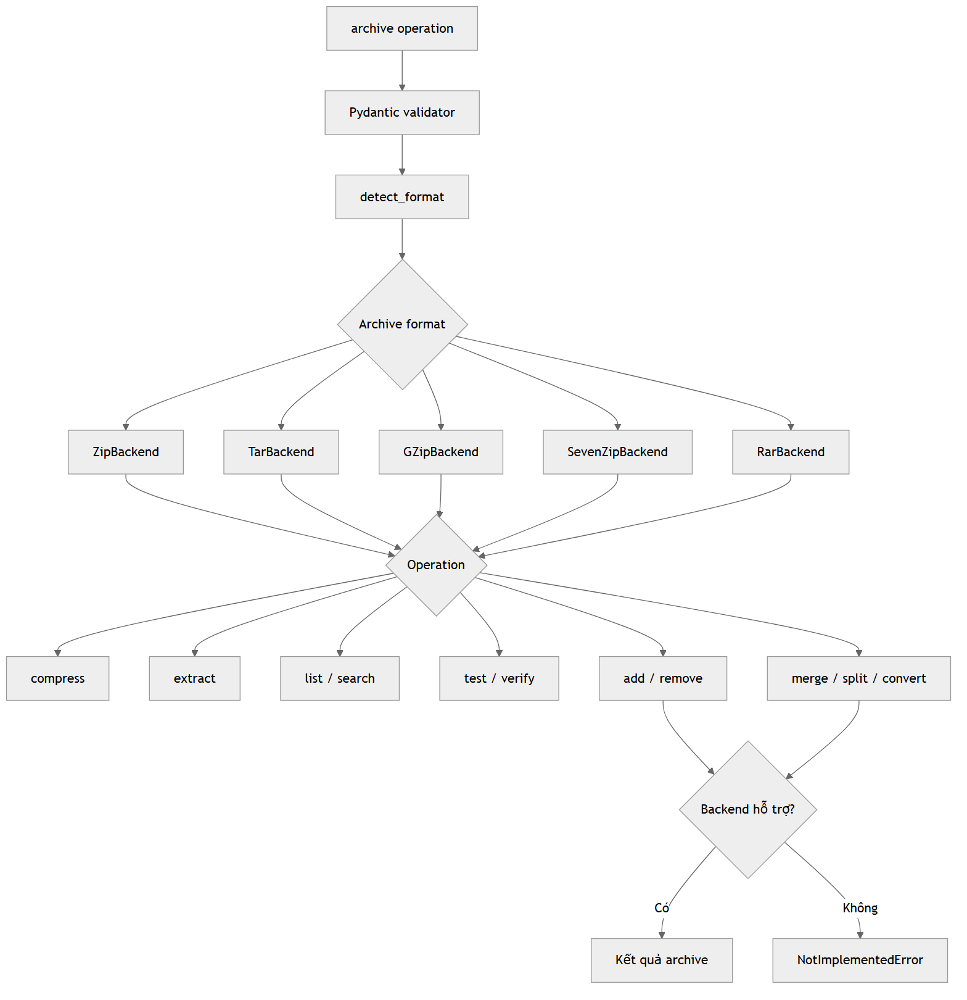

- **Chạy ở:** [`klygo/archive/backend`](../../klygo/archive/backend) và các entry point trong `klygo.archive`.
- **Đầu vào:** ZIP, TAR, GZip, 7Z hoặc RAR.
- **Xử lý:** validator → nhận dạng format → chọn backend → thực thi operation.
- **Đầu ra:** archive mới, file được giải nén, danh sách nội dung hoặc báo cáo verify.
- **Ứng dụng:** nhận dataset được đóng gói, kiểm tra archive trước xử lý hoặc chuyển đổi định dạng.
- **Lưu ý:** operation không được format hỗ trợ sẽ trả `NotImplementedError`.

## 06. Dataset workflow

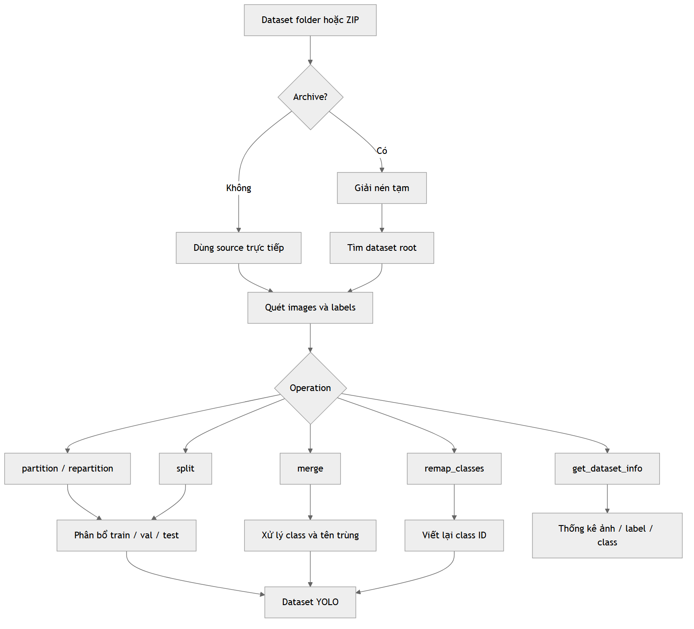

- **Chạy ở:** [`klygo/datasets`](../../klygo/datasets) và helper trong [`klygo/utils/dataset.py`](../../klygo/utils/dataset.py).
- **Đầu vào:** folder dataset hoặc archive chứa ảnh và nhãn YOLO.
- **Xử lý:** tìm dataset root → scan cặp image/label → partition, split, merge hoặc remap.
- **Đầu ra:** dataset YOLO có cấu trúc và class ID nhất quán.
- **Ứng dụng:** chuẩn bị dữ liệu train, hợp nhất nhiều dataset hoặc đổi hệ class.

---

## 07. Media pipeline

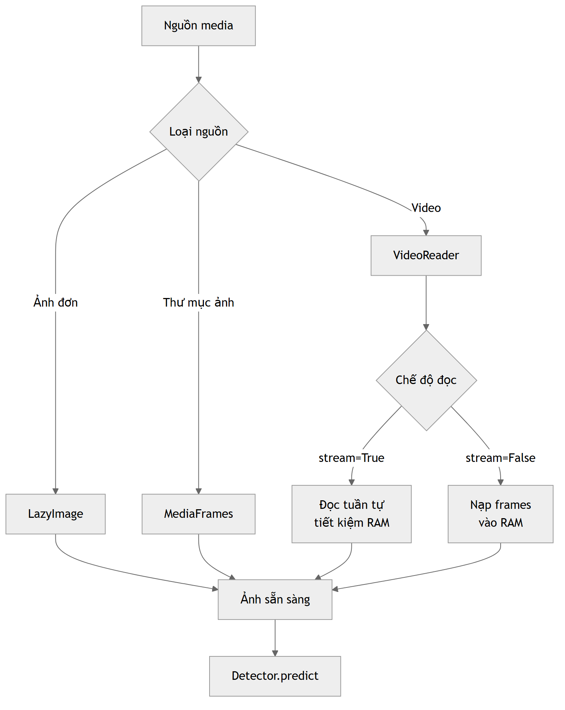

- **Chạy ở:** [`klygo/media/operations.py`](../../klygo/media/operations.py).
- **Entry point:** `media.load(source, recursive=False, stream=False, backend="pil")`.
- **Đầu vào:** ảnh đơn, thư mục ảnh hoặc video.
- **Đầu ra:** `MediaFrames` chứa các `LazyImage` và metadata nguồn.
- **Ứng dụng:** tạo một giao diện input thống nhất trước khi gọi model.

## 08. Resolve nguồn media

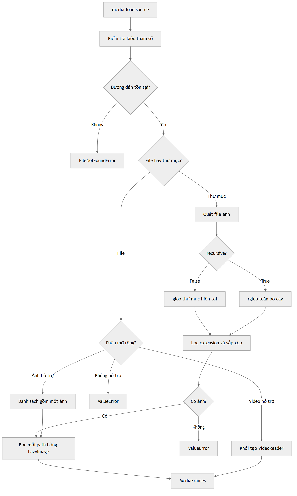

- **Chạy ở:** nhánh kiểm tra path và extension bên trong `media.load()`.
- **Quyết định:** nguồn tồn tại không, là file hay folder, ảnh hay video, có cần scan recursive không.
- **Lỗi chính:** `FileNotFoundError` cho path không tồn tại; `ValueError` cho format không hỗ trợ hoặc folder không có ảnh.
- **Đầu ra:** ảnh được bọc bằng `LazyImage` hoặc video được mở bằng `VideoReader`.
- **Ứng dụng:** debug lỗi input và bổ sung format media mới.

## 09. LazyImage và Zero-RAM

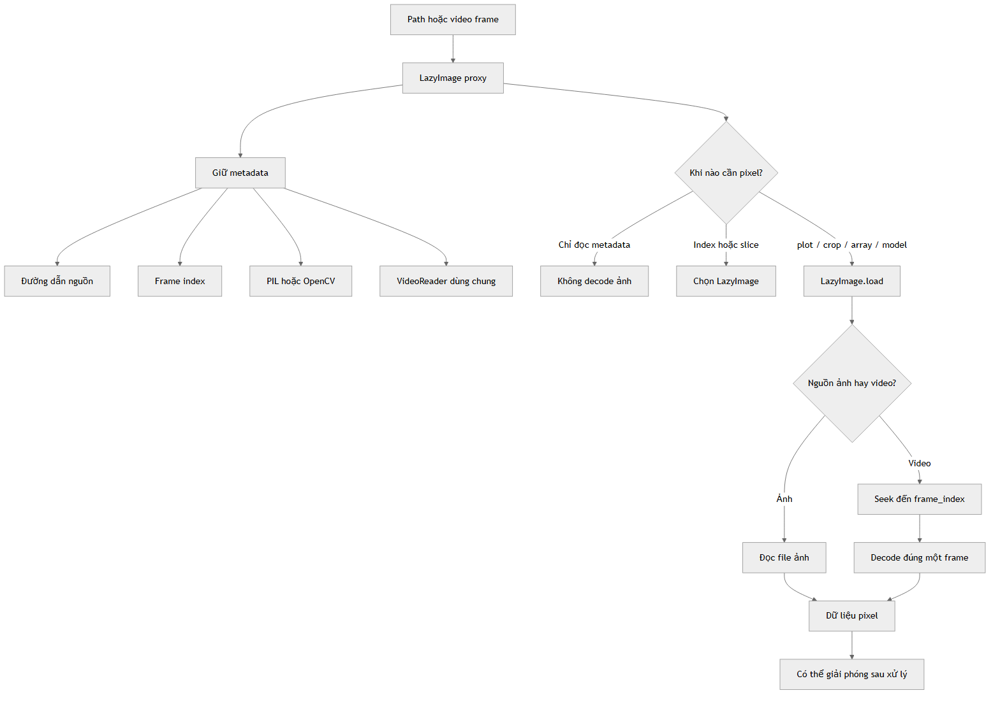

- **Chạy ở:** class `LazyImage` và `VideoReader` trong [`media/operations.py`](../../klygo/media/operations.py).
- **Cơ chế:** giữ path, frame index và reader; chỉ decode pixel khi thật sự gọi `load`, `plot`, `crop`, chuyển array hoặc inference.
- **Lợi ích:** đọc metadata, index và slice mà không nạp toàn bộ ảnh/video vào RAM.
- **Ứng dụng:** video dài, dataset ảnh lớn hoặc pipeline cần truy cập chọn lọc frame.

## 10. Streaming video

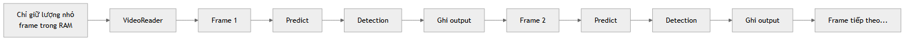

- **Chạy ở:** iterator của `MediaFrames` và `Detections` streaming.
- **Luồng:** đọc frame → predict → tạo `Detection` → ghi output → mới đọc frame tiếp theo.
- **Bộ nhớ:** chỉ giữ batch hiện tại và các frame đã được cache/truy cập.
- **Ứng dụng:** CCTV, video dài, xử lý batch nhỏ hoặc máy có RAM hạn chế.
- **Đọc tiếp:** ảnh 17 mô tả chính xác generator trong `Detector.predict(stream=True)`.

---

## 11. Model loading tổng quan

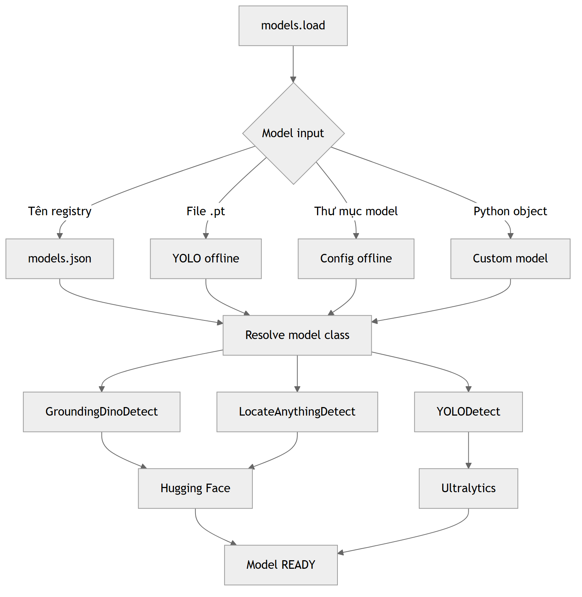

- **Chạy ở:** [`klygo/models/load.py`](../../klygo/models/load.py).
- **Entry point:** `models.load(model, **kwargs)`.
- **Nguồn model:** tên registry, file `.pt`, folder offline, metadata dict/Config hoặc Python model object.
- **Đầu ra:** một `BaseModel`/`Detector` ở trạng thái `READY`.
- **Ứng dụng:** tách code ứng dụng khỏi cách model thực tế được lưu hoặc cung cấp.

## 12. Model loading chi tiết

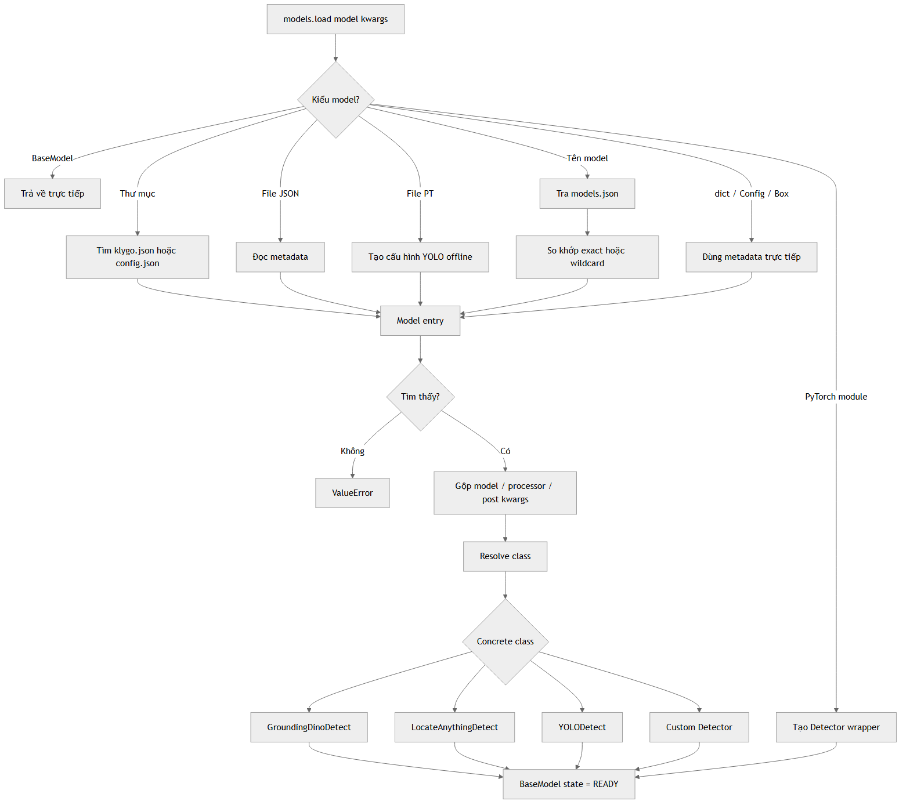

- **Registry:** [`klygo/models/models.json`](../../klygo/models/models.json) hỗ trợ key chính xác và wildcard.
- **Offline folder:** ưu tiên `klygo.json`, sau đó `config.json`.
- **YOLO offline:** file `.pt` được map sang `YOLODetect`.
- **Custom model:** PyTorch module được bọc trong `Detector`; class custom có thể resolve từ `model.py`.
- **Config:** kwargs runtime được hợp nhất với các nhóm `model`, `processor`, `post`.
- **Ứng dụng:** điều tra vì sao một model ID resolve sai hoặc thêm model vào registry.

## 13. Chuẩn bị prediction

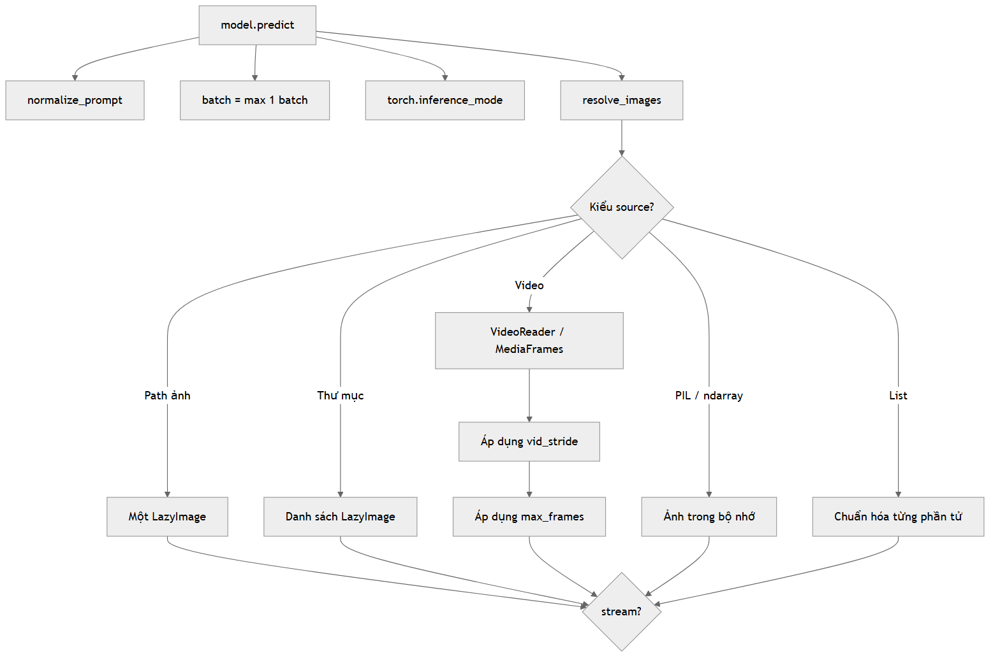

- **Chạy ở:** `Detector.predict()` và helper `models.utils.resolve_images()`.
- **Chuẩn hóa:** prompt, batch tối thiểu 1, inference context, `vid_stride` và `max_frames`.
- **Đầu vào:** path, PIL image, ndarray, list ảnh, folder hoặc video.
- **Điểm rẽ:** `stream=False` sang ảnh 16; `stream=True` sang ảnh 17.
- **Ứng dụng:** tuning tốc độ/bộ nhớ và giới hạn số frame cần inference.

## 14. Backend inference

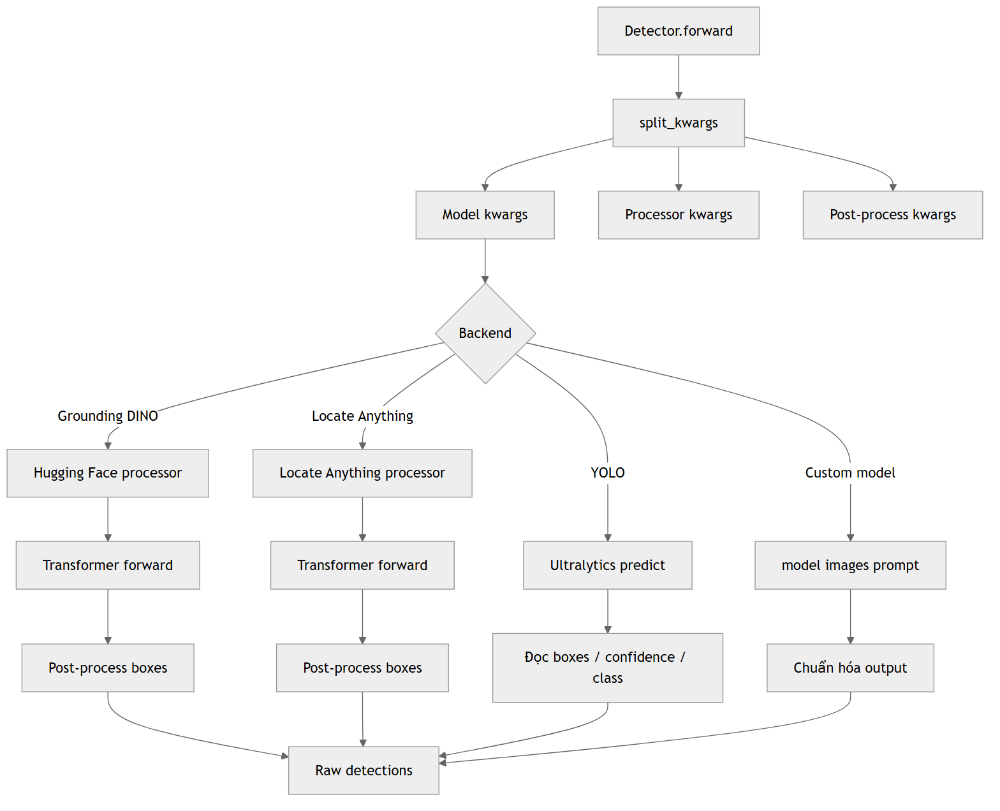

- **Chạy ở:** concrete detector và helper trong [`klygo/models/backend`](../../klygo/models/backend).
- **Grounding DINO:** processor Hugging Face → transformer forward → post-process bbox.
- **Locate Anything:** adapter riêng cho processor/model tương ứng.
- **YOLO:** gọi Ultralytics với confidence và IoU threshold.
- **Custom model:** gọi trực tiếp model callable rồi chuẩn hóa output.
- **Đầu ra:** raw detections gồm boxes, scores và labels.

## 15. Prediction tổng quan

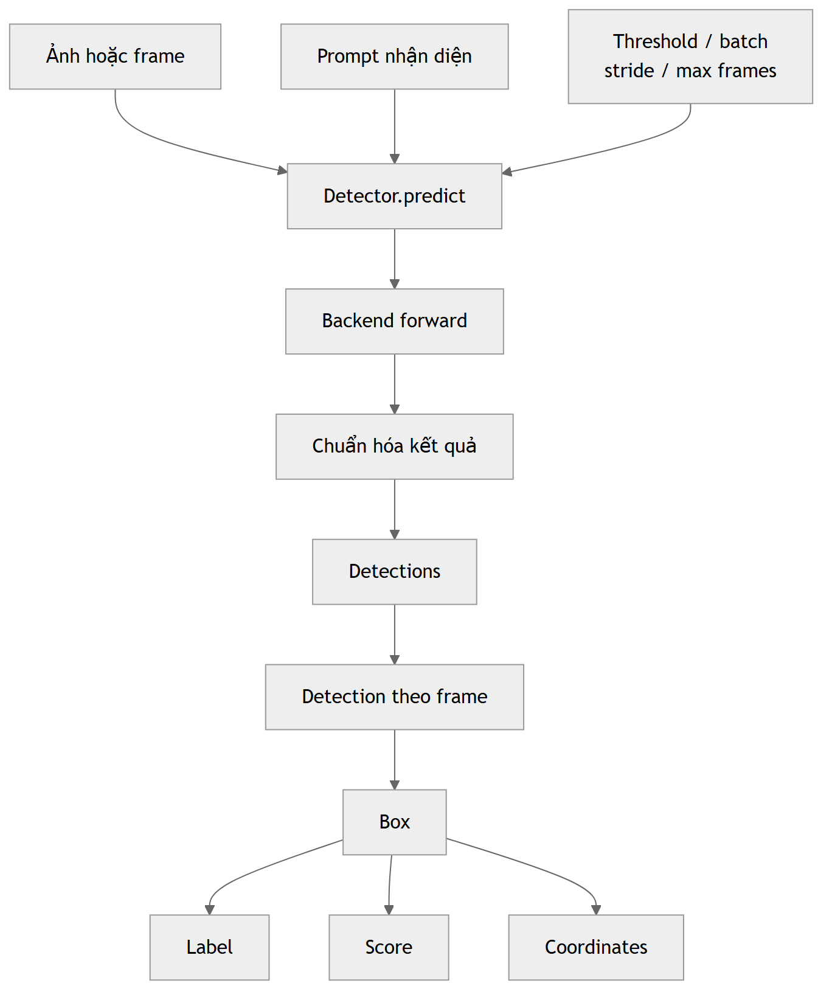

- **Chạy ở:** `Detector.predict()`, `Detector.forward()` và `_pack_detection()`.
- **Đầu vào:** media đã resolve, prompt và runtime settings.
- **Luồng:** backend forward → raw result → chuẩn hóa → `Detections`.
- **Ứng dụng:** sơ đồ ngắn để giải thích inference API cho người dùng thư viện.

## 16. Prediction chế độ thường

- **Kích hoạt:** `model.predict(..., stream=False)`.
- **Cơ chế:** resolve toàn bộ danh sách input, chạy từng batch và append tất cả frame result vào RAM.
- **Đầu ra:** `Detections` chứa list `Detection` hoàn chỉnh.
- **Ưu điểm:** index, sort, thống kê và truy cập toàn bộ kết quả ngay lập tức.
- **Dùng khi:** ảnh đơn, folder nhỏ hoặc video ngắn.

## 17. Prediction streaming

- **Kích hoạt:** `model.predict(..., stream=True)`.
- **Cơ chế:** `itertools.islice` lấy từng batch; mỗi `Detection` được `yield` sau inference.
- **Đầu ra:** `Detections` bọc generator và chỉ cache phần đã đọc.
- **Ưu điểm:** không cần giữ toàn bộ kết quả/video trong RAM.
- **Dùng khi:** video dài, pipeline online hoặc lưu output tuần tự.

## 18. Chuẩn hóa kết quả

- **Chạy ở:** `Detector._pack_detection()`.
- **Ảnh nguồn:** giữ `LazyImage`, bọc lại từ path hoặc giữ object ảnh trong bộ nhớ.
- **Raw dict:** chuyển từng bộ `box/score/label` thành `Box` rồi tạo `Detection`.
- **Detection có sẵn:** gắn lại `source_image` và `parent_image`.
- **Metadata bổ sung:** URL/path, frame index, inference latency và FPS.
- **Ứng dụng:** giúp mọi backend trả cùng một public output API.

---

## 19. Cấu trúc output

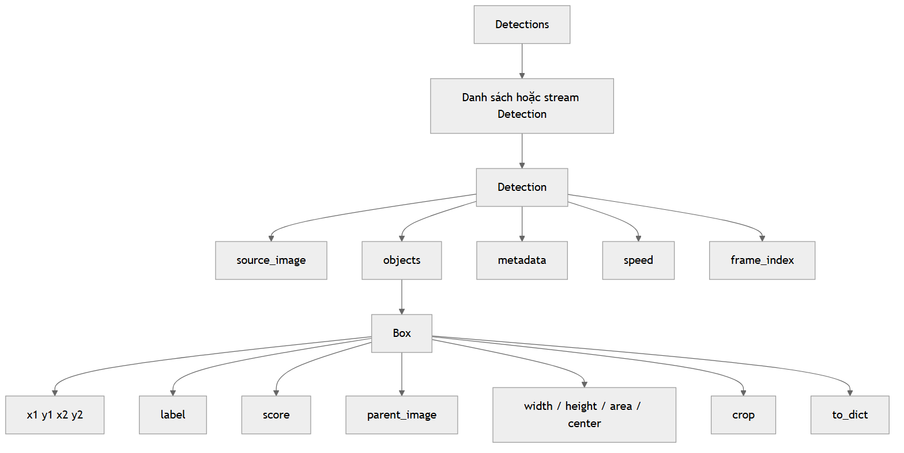

- **Chạy ở:** [`klygo/outputs/detect.py`](../../klygo/outputs/detect.py).
- **`Detections`:** collection nhiều frame hoặc stream.
- **`Detection`:** kết quả của một ảnh/frame, giữ ảnh nguồn và danh sách object.
- **`Box`:** tọa độ, label, score và liên kết tới ảnh cha.
- **`Crops`:** collection các object được crop từ một hoặc nhiều frame.
- **Ứng dụng:** đây là API mà code ứng dụng nên sử dụng thay vì đọc output riêng của backend.

## 20. Output workflow

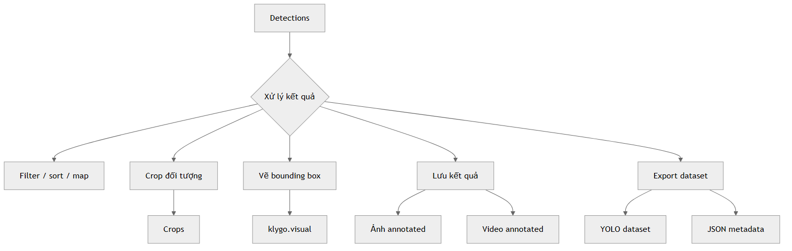

- **Điểm bắt đầu:** object `Detections` trả về từ `predict()`.
- **Nhánh xử lý:** filter/map/sort, crop object, vẽ bbox, lưu media hoặc export dataset.
- **Ứng dụng:** chọn bước hậu xử lý phù hợp với sản phẩm: xem kết quả, lưu bằng chứng hoặc tạo dữ liệu train.
- **Đọc tiếp:** ảnh 21–23 mô tả chi tiết từng nhóm hành động.

## 21. Các phép xử lý Detections

- **Collection:** index, slice, append, extend, filter, map và sort.
- **Streaming:** index sẽ đọc đến vị trí cần thiết; `filter` và `map` tiếp tục giữ generator lazy.
- **Chuyển đổi:** `plot`, `draw`, `to_array`, `to_numpy`, `to_bgr`.
- **Tổng hợp:** `total_objects`, `unique_labels`, `label_counts`.
- **Ứng dụng:** analytics, lọc frame có object và tích hợp với NumPy/OpenCV.

## 22. Lưu kết quả

- **Chạy ở:** `Detections.save()`.
- **Video:** `iter_images()` vẽ từng frame rồi chuyển generator sang `media.save_video()`.
- **Ảnh/folder:** tạo output directory và lưu tuần tự `annotated_N.jpg`.
- **Đầu ra:** video annotated hoặc thư mục ảnh annotated.
- **Ứng dụng:** lưu kết quả cuối cho người dùng, review hoặc downstream system.

## 23. Export YOLO dataset

- **Chạy ở:** `Detections.export(output_path, format="yolo")`.
- **Xử lý:** tạo `images/`, `labels/`, tổng hợp class, lưu ảnh và chuẩn hóa bbox sang YOLO.
- **Đầu ra:** ảnh, label `.txt` và `data.yaml`.
- **Ứng dụng:** biến kết quả inference thành dataset để kiểm tra, fine-tune hoặc retrain model.

---

## Ví dụ mapping theo ứng dụng

### Nhận diện một ảnh

`07 → 08 → 11 → 13 → 14 → 15 → 18 → 19 → 20`

### Nhận diện video dài và lưu video annotated

`07 → 09 → 10 → 11 → 13 → 17 → 18 → 19 → 22`

### Tạo dataset YOLO từ kết quả inference

`06 → 07 → 11 → 13 → 16/17 → 18 → 19 → 23`

### Thêm một detector mới

`03 → 11 → 12 → 14 → 18 → 19`

### Debug lỗi input media

`07 → 08 → 09`
