# Klygo workflow diagrams

## 01. Tổng quan hệ thống

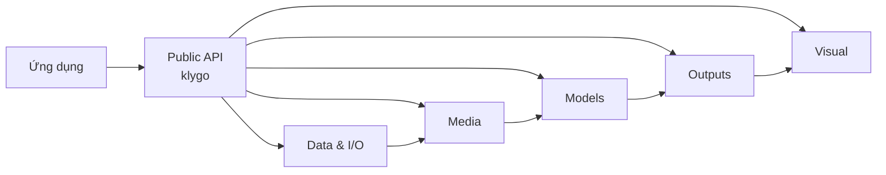
```mermaid
flowchart LR
    U[Ứng dụng] --> K[Public API<br/>klygo]
    K --> IO[Data & I/O]
    K --> M[Media]
    K --> AI[Models]
    K --> O[Outputs]
    K --> V[Visual]
    IO --> M
    M --> AI
    AI --> O
    O --> V
```

## 02. Data và I/O

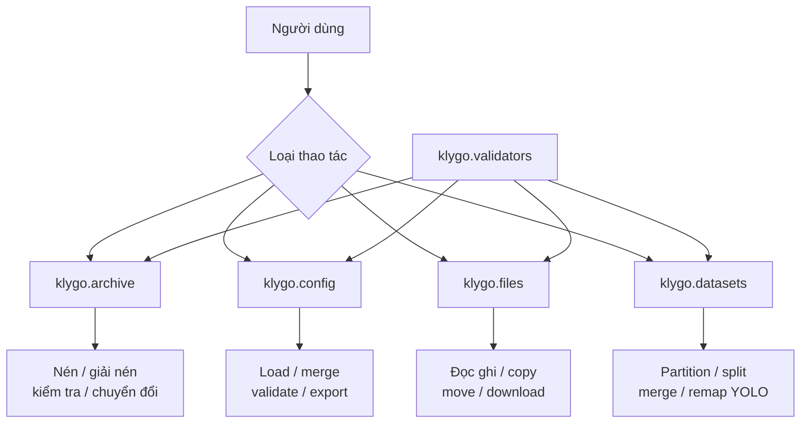
```mermaid
flowchart TD
    U[Người dùng] --> F{Loại thao tác}
    F --> A[klygo.archive]
    F --> C[klygo.config]
    F --> FS[klygo.files]
    F --> D[klygo.datasets]
    VAL[klygo.validators] --> A
    VAL --> C
    VAL --> FS
    VAL --> D
    A --> AO[Nén / giải nén<br/>kiểm tra / chuyển đổi]
    C --> CO[Load / merge<br/>validate / export]
    FS --> FO[Đọc ghi / copy<br/>move / download]
    D --> DO[Partition / split<br/>merge / remap YOLO]
```

## 03. Media pipeline

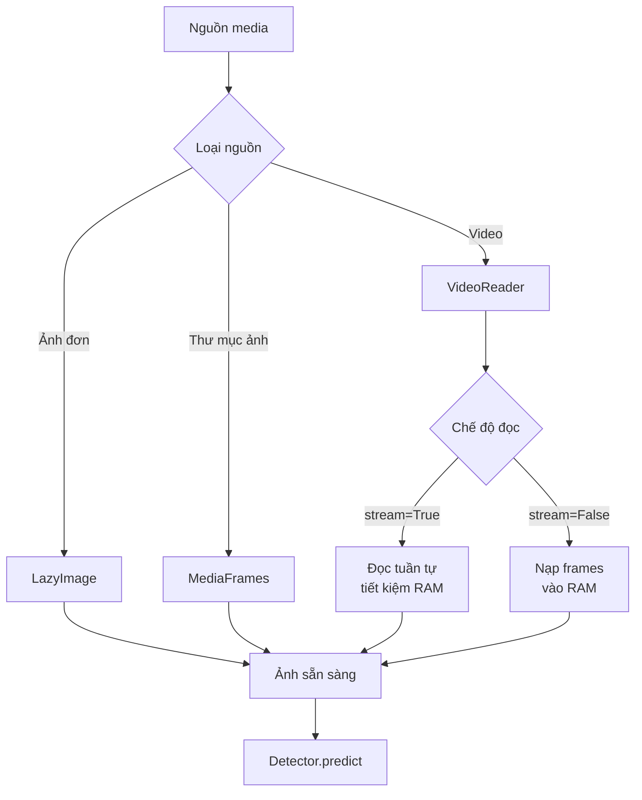
```mermaid
flowchart TD
    S[Nguồn media] --> TYPE{Loại nguồn}
    TYPE -->|Ảnh đơn| IMG[LazyImage]
    TYPE -->|Thư mục ảnh| DIR[MediaFrames]
    TYPE -->|Video| VID[VideoReader]
    VID --> MODE{Chế độ đọc}
    MODE -->|stream=True| STREAM[Đọc tuần tự<br/>tiết kiệm RAM]
    MODE -->|stream=False| MEMORY[Nạp frames<br/>vào RAM]
    IMG --> READY[Ảnh sẵn sàng]
    DIR --> READY
    STREAM --> READY
    MEMORY --> READY
    READY --> MODEL[Detector.predict]
```

## 04. Model loading

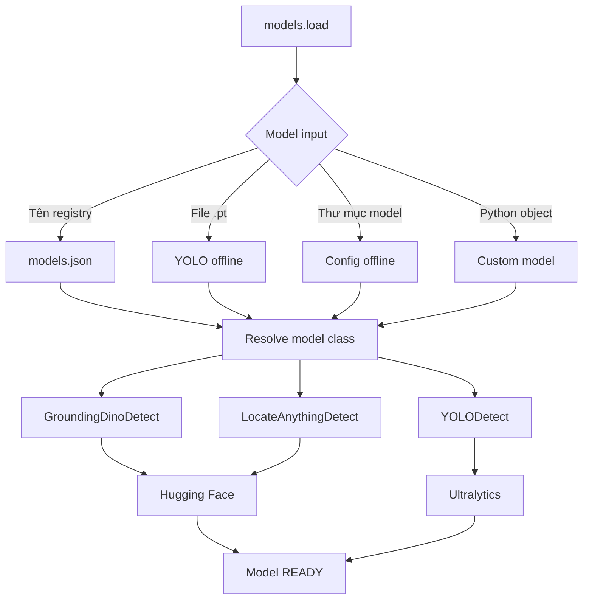
```mermaid
flowchart TD
    CALL[models.load] --> INPUT{Model input}
    INPUT -->|Tên registry| JSON[models.json]
    INPUT -->|File .pt| YOLOCFG[YOLO offline]
    INPUT -->|Thư mục model| LOCAL[Config offline]
    INPUT -->|Python object| CUSTOM[Custom model]
    JSON --> RESOLVE[Resolve model class]
    YOLOCFG --> RESOLVE
    LOCAL --> RESOLVE
    CUSTOM --> RESOLVE
    RESOLVE --> DINO[GroundingDinoDetect]
    RESOLVE --> LOCATE[LocateAnythingDetect]
    RESOLVE --> YOLO[YOLODetect]
    DINO --> HF[Hugging Face]
    LOCATE --> HF
    YOLO --> ULTRA[Ultralytics]
    HF --> READY[Model READY]
    ULTRA --> READY
```

## 05. Prediction pipeline

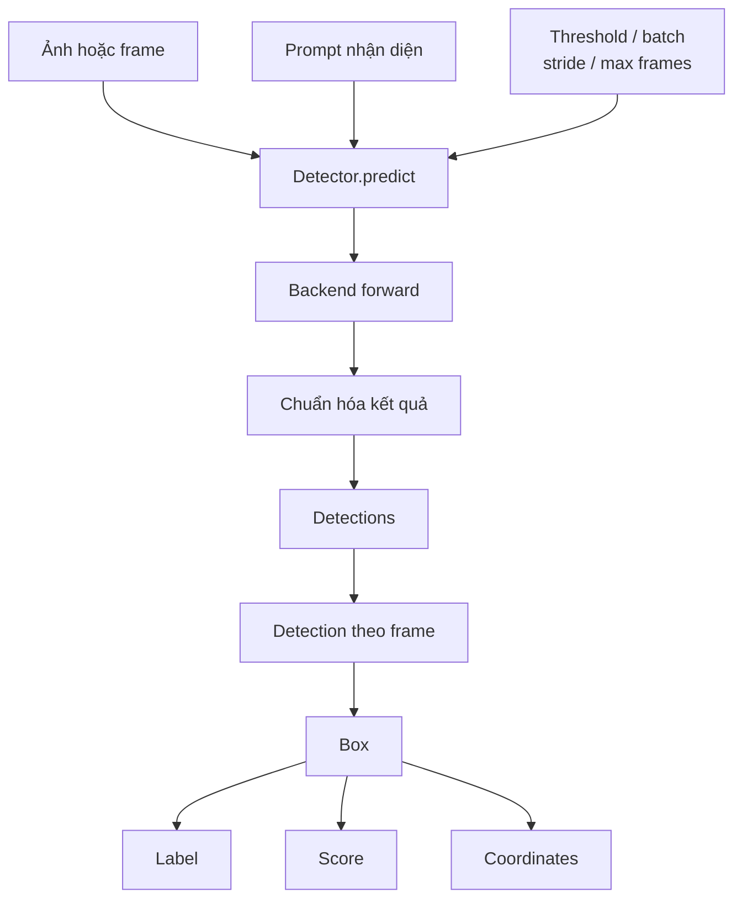
```mermaid
flowchart TD
    MEDIA[Ảnh hoặc frame] --> PREDICT[Detector.predict]
    PROMPT[Prompt nhận diện] --> PREDICT
    SETTINGS[Threshold / batch<br/>stride / max frames] --> PREDICT
    PREDICT --> FORWARD[Backend forward]
    FORWARD --> PACK[Chuẩn hóa kết quả]
    PACK --> RESULTS[Detections]
    RESULTS --> FRAME[Detection theo frame]
    FRAME --> BOX[Box]
    BOX --> LABEL[Label]
    BOX --> SCORE[Score]
    BOX --> COORD[Coordinates]
```

## 06. Output workflow

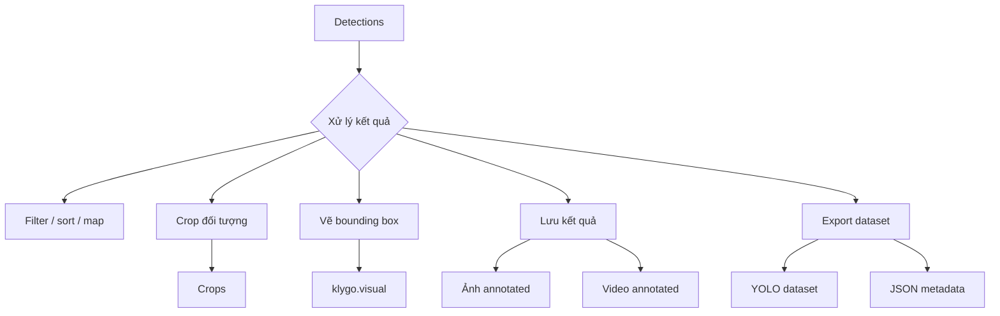
```mermaid
flowchart TD
    RESULTS[Detections] --> ACTION{Xử lý kết quả}
    ACTION --> FILTER[Filter / sort / map]
    ACTION --> CROP[Crop đối tượng]
    ACTION --> DRAW[Vẽ bounding box]
    ACTION --> SAVE[Lưu kết quả]
    ACTION --> EXPORT[Export dataset]
    CROP --> CROPS[Crops]
    DRAW --> VISUAL[klygo.visual]
    SAVE --> IMAGE[Ảnh annotated]
    SAVE --> VIDEO[Video annotated]
    EXPORT --> YOLO[YOLO dataset]
    EXPORT --> JSON[JSON metadata]
```

## 07. Streaming video

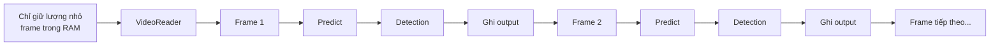
```mermaid
flowchart LR
    VIDEO[VideoReader] --> F1[Frame 1]
    F1 --> P1[Predict]
    P1 --> O1[Detection]
    O1 --> W1[Ghi output]
    W1 --> F2[Frame 2]
    F2 --> P2[Predict]
    P2 --> O2[Detection]
    O2 --> W2[Ghi output]
    W2 --> NEXT[Frame tiếp theo...]
    NOTE[Chỉ giữ lượng nhỏ<br/>frame trong RAM] --> VIDEO
```

## 08. Luồng module chi tiết

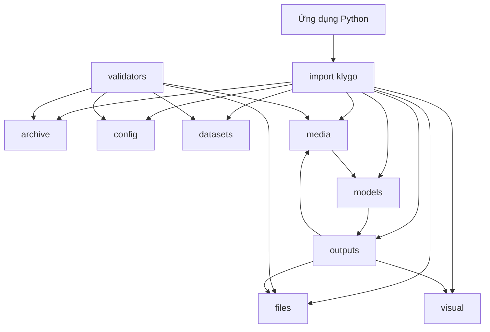
```mermaid
flowchart TD
    APP[Ứng dụng Python] --> API[import klygo]
    API --> ARCHIVE[archive]
    API --> CONFIG[config]
    API --> FILES[files]
    API --> DATASETS[datasets]
    API --> MEDIA[media]
    API --> MODELS[models]
    API --> OUTPUTS[outputs]
    API --> VISUAL[visual]
    VALIDATORS[validators] --> ARCHIVE
    VALIDATORS --> CONFIG
    VALIDATORS --> FILES
    VALIDATORS --> DATASETS
    VALIDATORS --> MEDIA
    MEDIA --> MODELS
    MODELS --> OUTPUTS
    OUTPUTS --> VISUAL
    OUTPUTS --> FILES
    OUTPUTS --> MEDIA
```

## 09. Xác định nguồn media

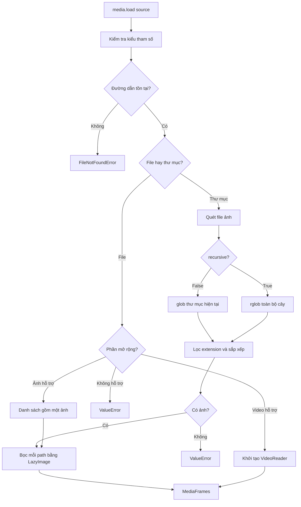
```mermaid
flowchart TD
    LOAD[media.load source] --> VALIDATE[Kiểm tra kiểu tham số]
    VALIDATE --> EXISTS{Đường dẫn tồn tại?}
    EXISTS -->|Không| NOT_FOUND[FileNotFoundError]
    EXISTS -->|Có| SOURCE_TYPE{File hay thư mục?}
    SOURCE_TYPE -->|File| SUFFIX{Phần mở rộng?}
    SUFFIX -->|Ảnh hỗ trợ| SINGLE[Danh sách gồm một ảnh]
    SUFFIX -->|Video hỗ trợ| VIDEO[Khởi tạo VideoReader]
    SUFFIX -->|Không hỗ trợ| FORMAT_ERROR[ValueError]
    SOURCE_TYPE -->|Thư mục| SCAN[Quét file ảnh]
    SCAN --> RECURSIVE{recursive?}
    RECURSIVE -->|False| GLOB[glob thư mục hiện tại]
    RECURSIVE -->|True| RGLOB[rglob toàn bộ cây]
    GLOB --> SORT[Lọc extension và sắp xếp]
    RGLOB --> SORT
    SORT --> EMPTY{Có ảnh?}
    EMPTY -->|Không| EMPTY_ERROR[ValueError]
    EMPTY -->|Có| WRAP[Bọc mỗi path bằng LazyImage]
    SINGLE --> WRAP
    WRAP --> FRAMES[MediaFrames]
    VIDEO --> FRAMES
```

## 10. LazyImage và Zero-RAM

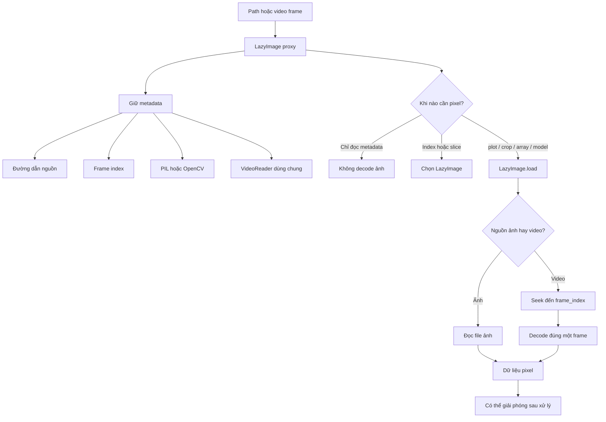
```mermaid
flowchart TD
    SOURCE[Path hoặc video frame] --> LAZY[LazyImage proxy]
    LAZY --> META[Giữ metadata]
    META --> PATH[Đường dẫn nguồn]
    META --> INDEX[Frame index]
    META --> BACKEND[PIL hoặc OpenCV]
    META --> READER[VideoReader dùng chung]
    LAZY --> ACCESS{Khi nào cần pixel?}
    ACCESS -->|Chỉ đọc metadata| NO_LOAD[Không decode ảnh]
    ACCESS -->|Index hoặc slice| SELECT[Chọn LazyImage]
    ACCESS -->|plot / crop / array / model| EVALUATE[LazyImage.load]
    EVALUATE --> SOURCE_KIND{Nguồn ảnh hay video?}
    SOURCE_KIND -->|Ảnh| IMAGE_READ[Đọc file ảnh]
    SOURCE_KIND -->|Video| SEEK[Seek đến frame_index]
    SEEK --> DECODE[Decode đúng một frame]
    IMAGE_READ --> PIXELS[Dữ liệu pixel]
    DECODE --> PIXELS
    PIXELS --> RELEASE[Có thể giải phóng sau xử lý]
```

## 11. Nạp model chi tiết

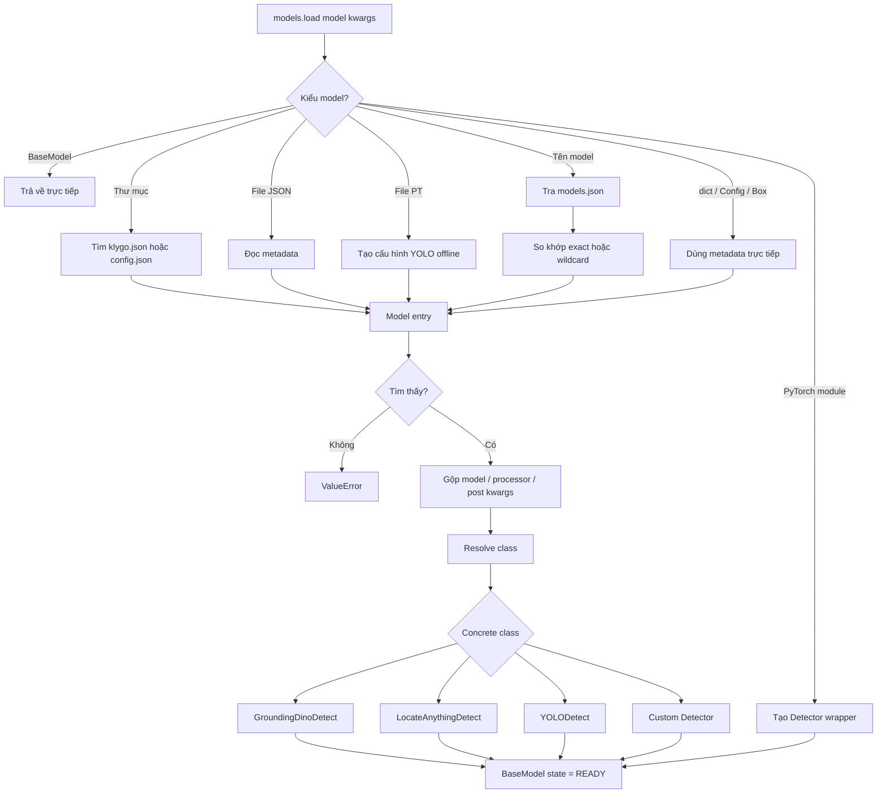
```mermaid
flowchart TD
    LOAD[models.load model kwargs] --> INPUT{Kiểu model?}
    INPUT -->|BaseModel| RETURN[Trả về trực tiếp]
    INPUT -->|PyTorch module| WRAPPER[Tạo Detector wrapper]
    INPUT -->|dict / Config / Box| CONFIG_ENTRY[Dùng metadata trực tiếp]
    INPUT -->|Thư mục| DIRECTORY[Tìm klygo.json hoặc config.json]
    INPUT -->|File JSON| JSON[Đọc metadata]
    INPUT -->|File PT| PT[Tạo cấu hình YOLO offline]
    INPUT -->|Tên model| REGISTRY[Tra models.json]
    DIRECTORY --> ENTRY[Model entry]
    JSON --> ENTRY
    PT --> ENTRY
    REGISTRY --> PATTERN[So khớp exact hoặc wildcard]
    PATTERN --> ENTRY
    CONFIG_ENTRY --> ENTRY
    ENTRY --> FOUND{Tìm thấy?}
    FOUND -->|Không| ERROR[ValueError]
    FOUND -->|Có| MERGE[Gộp model / processor / post kwargs]
    MERGE --> CLASS[Resolve class]
    CLASS --> TYPE{Concrete class}
    TYPE --> DINO[GroundingDinoDetect]
    TYPE --> LOCATE[LocateAnythingDetect]
    TYPE --> YOLO[YOLODetect]
    TYPE --> CUSTOM[Custom Detector]
    DINO --> READY[BaseModel state = READY]
    LOCATE --> READY
    YOLO --> READY
    CUSTOM --> READY
    WRAPPER --> READY
```

## 12. Chuẩn bị prediction

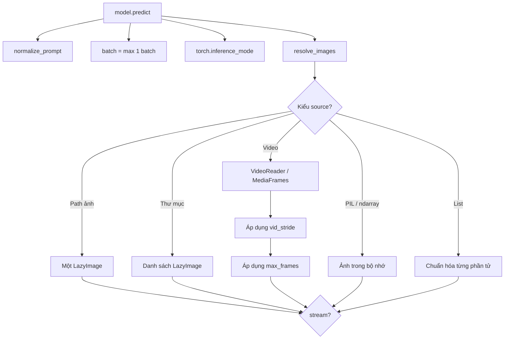
```mermaid
flowchart TD
    CALL[model.predict] --> PROMPT[normalize_prompt]
    CALL --> BATCH[batch = max 1 batch]
    CALL --> CONTEXT[torch.inference_mode]
    CALL --> RESOLVE[resolve_images]
    RESOLVE --> SOURCE{Kiểu source?}
    SOURCE -->|Path ảnh| ONE[Một LazyImage]
    SOURCE -->|Thư mục| MANY[Danh sách LazyImage]
    SOURCE -->|Video| VIDEO[VideoReader / MediaFrames]
    SOURCE -->|PIL / ndarray| MEMORY[Ảnh trong bộ nhớ]
    SOURCE -->|List| LIST[Chuẩn hóa từng phần tử]
    VIDEO --> STRIDE[Áp dụng vid_stride]
    STRIDE --> LIMIT[Áp dụng max_frames]
    ONE --> MODE{stream?}
    MANY --> MODE
    LIMIT --> MODE
    MEMORY --> MODE
    LIST --> MODE
```

## 13. Prediction chế độ thường

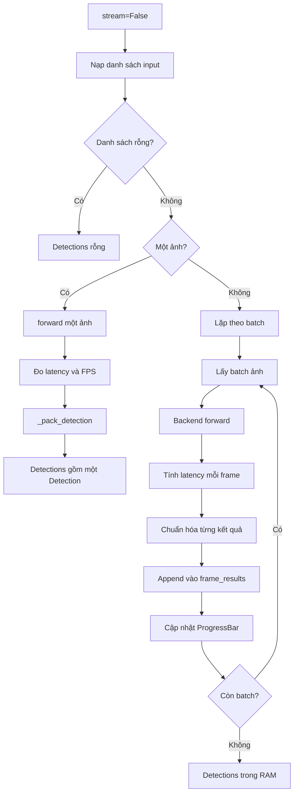
```mermaid
flowchart TD
    START[stream=False] --> RESOLVE[Nạp danh sách input]
    RESOLVE --> EMPTY{Danh sách rỗng?}
    EMPTY -->|Có| EMPTY_RESULT[Detections rỗng]
    EMPTY -->|Không| SINGLE{Một ảnh?}
    SINGLE -->|Có| FORWARD_ONE[forward một ảnh]
    FORWARD_ONE --> TIME_ONE[Đo latency và FPS]
    TIME_ONE --> PACK_ONE[_pack_detection]
    PACK_ONE --> ONE_RESULT[Detections gồm một Detection]
    SINGLE -->|Không| LOOP[Lặp theo batch]
    LOOP --> TAKE[Lấy batch ảnh]
    TAKE --> FORWARD[Backend forward]
    FORWARD --> TIME[Tính latency mỗi frame]
    TIME --> PACK[Chuẩn hóa từng kết quả]
    PACK --> APPEND[Append vào frame_results]
    APPEND --> PROGRESS[Cập nhật ProgressBar]
    PROGRESS --> MORE{Còn batch?}
    MORE -->|Có| TAKE
    MORE -->|Không| RESULTS[Detections trong RAM]
```

## 14. Prediction streaming

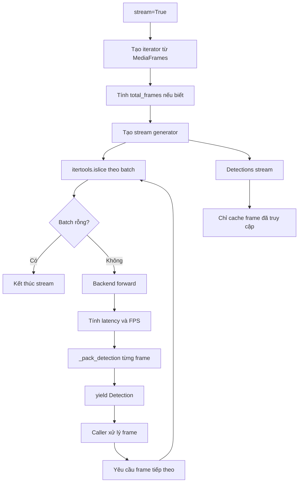
```mermaid
flowchart TD
    START[stream=True] --> ITERATOR[Tạo iterator từ MediaFrames]
    ITERATOR --> TOTAL[Tính total_frames nếu biết]
    TOTAL --> GENERATOR[Tạo stream generator]
    GENERATOR --> TAKE[itertools.islice theo batch]
    TAKE --> EMPTY{Batch rỗng?}
    EMPTY -->|Có| STOP[Kết thúc stream]
    EMPTY -->|Không| FORWARD[Backend forward]
    FORWARD --> METRICS[Tính latency và FPS]
    METRICS --> PACK[_pack_detection từng frame]
    PACK --> YIELD[yield Detection]
    YIELD --> CONSUMER[Caller xử lý frame]
    CONSUMER --> NEXT[Yêu cầu frame tiếp theo]
    NEXT --> TAKE
    GENERATOR --> RESULTS[Detections stream]
    RESULTS --> CACHE[Chỉ cache frame đã truy cập]
```

## 15. Backend inference

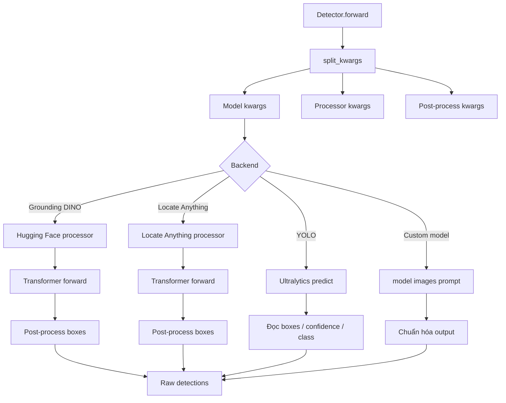
```mermaid
flowchart TD
    FORWARD[Detector.forward] --> SPLIT[split_kwargs]
    SPLIT --> MODEL_ARGS[Model kwargs]
    SPLIT --> PROCESSOR_ARGS[Processor kwargs]
    SPLIT --> POST_ARGS[Post-process kwargs]
    MODEL_ARGS --> BACKEND{Backend}
    BACKEND -->|Grounding DINO| HF_PRE[Hugging Face processor]
    BACKEND -->|Locate Anything| LOC_PRE[Locate Anything processor]
    BACKEND -->|YOLO| YOLO_CALL[Ultralytics predict]
    BACKEND -->|Custom model| CUSTOM_CALL[model images prompt]
    HF_PRE --> HF_MODEL[Transformer forward]
    HF_MODEL --> HF_POST[Post-process boxes]
    LOC_PRE --> LOC_MODEL[Transformer forward]
    LOC_MODEL --> LOC_POST[Post-process boxes]
    YOLO_CALL --> YOLO_POST[Đọc boxes / confidence / class]
    CUSTOM_CALL --> CUSTOM_POST[Chuẩn hóa output]
    HF_POST --> RAW[Raw detections]
    LOC_POST --> RAW
    YOLO_POST --> RAW
    CUSTOM_POST --> RAW
```

## 16. Chuẩn hóa kết quả

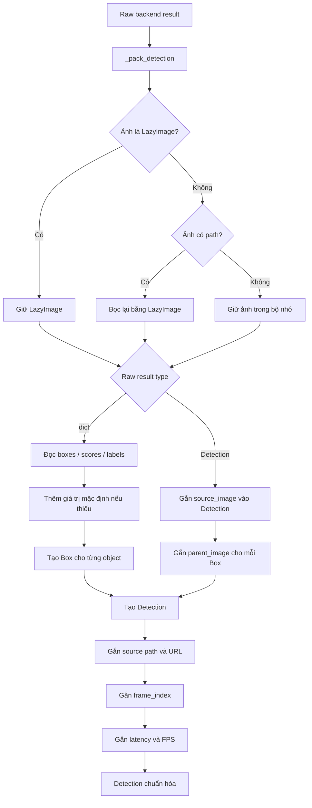
```mermaid
flowchart TD
    RAW[Raw backend result] --> PACK[_pack_detection]
    PACK --> IMAGE{Ảnh là LazyImage?}
    IMAGE -->|Có| KEEP[Giữ LazyImage]
    IMAGE -->|Không| PATH{Ảnh có path?}
    PATH -->|Có| WRAP[Bọc lại bằng LazyImage]
    PATH -->|Không| MEMORY[Giữ ảnh trong bộ nhớ]
    KEEP --> RESULT_TYPE{Raw result type}
    WRAP --> RESULT_TYPE
    MEMORY --> RESULT_TYPE
    RESULT_TYPE -->|dict| READ[Đọc boxes / scores / labels]
    READ --> DEFAULTS[Thêm giá trị mặc định nếu thiếu]
    DEFAULTS --> BOX_LOOP[Tạo Box cho từng object]
    BOX_LOOP --> DETECTION[Tạo Detection]
    RESULT_TYPE -->|Detection| ATTACH[Gắn source_image vào Detection]
    ATTACH --> PARENT[Gắn parent_image cho mỗi Box]
    PARENT --> DETECTION
    DETECTION --> META[Gắn source path và URL]
    META --> INDEX[Gắn frame_index]
    INDEX --> SPEED[Gắn latency và FPS]
    SPEED --> FINAL[Detection chuẩn hóa]
```

## 17. Cấu trúc output

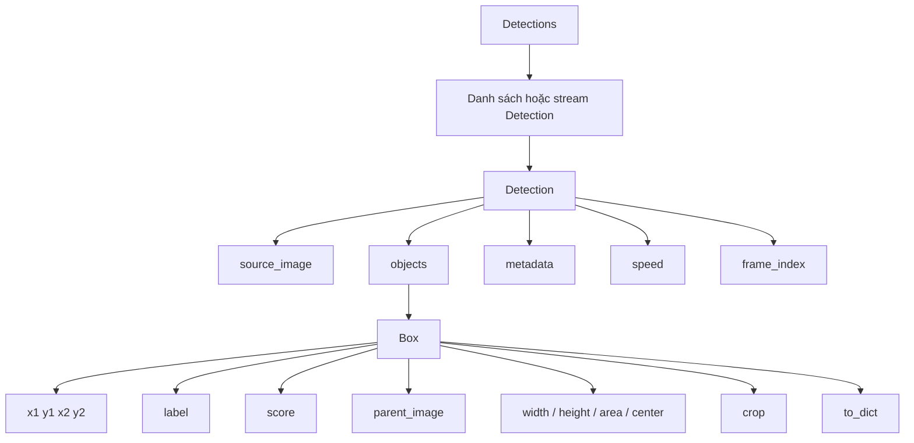
```mermaid
flowchart TD
    DETECTIONS[Detections] --> FRAMES[Danh sách hoặc stream Detection]
    FRAMES --> DETECTION[Detection]
    DETECTION --> SOURCE[source_image]
    DETECTION --> OBJECTS[objects]
    DETECTION --> META[metadata]
    DETECTION --> SPEED[speed]
    DETECTION --> FRAME_INDEX[frame_index]
    OBJECTS --> BOX[Box]
    BOX --> COORDS[x1 y1 x2 y2]
    BOX --> LABEL[label]
    BOX --> SCORE[score]
    BOX --> PARENT[parent_image]
    BOX --> GEOMETRY[width / height / area / center]
    BOX --> CROP[crop]
    BOX --> SERIALIZE[to_dict]
```

## 18. Xử lý Detections

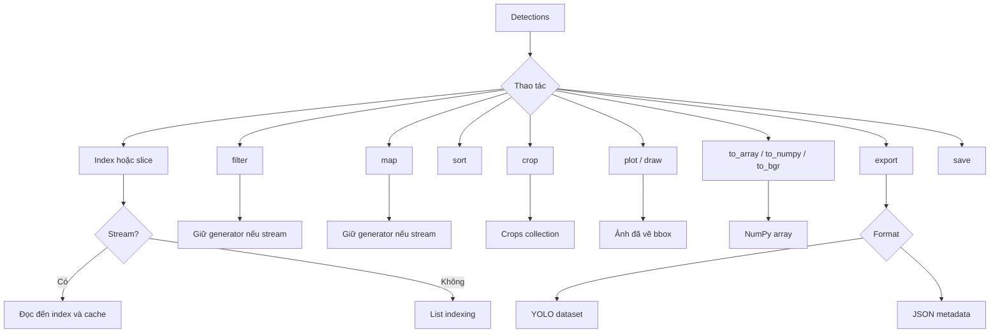
```mermaid
flowchart TD
    RESULTS[Detections] --> ACTION{Thao tác}
    ACTION --> INDEX[Index hoặc slice]
    ACTION --> FILTER[filter]
    ACTION --> MAP[map]
    ACTION --> SORT[sort]
    ACTION --> CROP[crop]
    ACTION --> PLOT[plot / draw]
    ACTION --> ARRAY[to_array / to_numpy / to_bgr]
    ACTION --> EXPORT[export]
    ACTION --> SAVE[save]
    INDEX --> MODE{Stream?}
    MODE -->|Có| CACHE[Đọc đến index và cache]
    MODE -->|Không| LIST_INDEX[List indexing]
    FILTER --> LAZY_FILTER[Giữ generator nếu stream]
    MAP --> LAZY_MAP[Giữ generator nếu stream]
    CROP --> CROPS[Crops collection]
    PLOT --> ANNOTATED[Ảnh đã vẽ bbox]
    ARRAY --> NUMPY[NumPy array]
    EXPORT --> FORMAT{Format}
    FORMAT --> YOLO[YOLO dataset]
    FORMAT --> JSON[JSON metadata]
```

## 19. Lưu kết quả

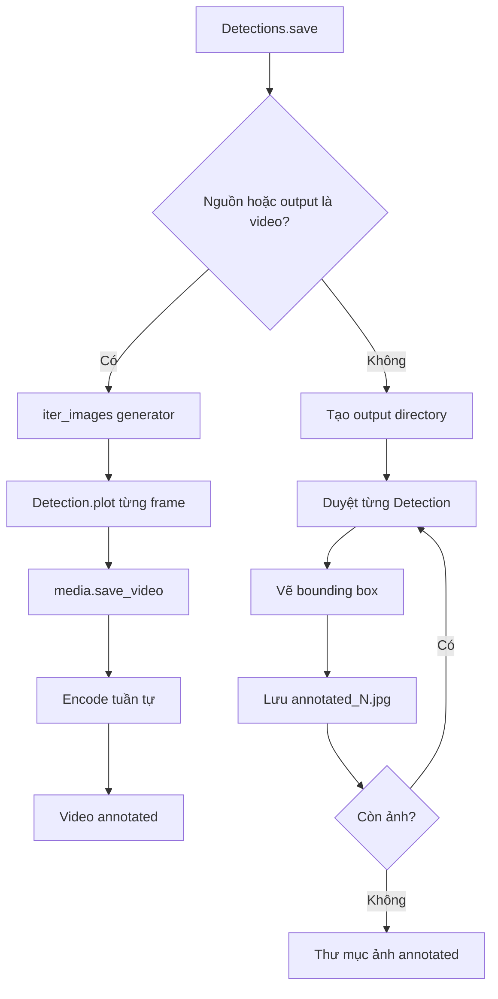
```mermaid
flowchart TD
    SAVE[Detections.save] --> TARGET{Nguồn hoặc output là video?}
    TARGET -->|Có| ITER[iter_images generator]
    ITER --> FRAME[Detection.plot từng frame]
    FRAME --> WRITER[media.save_video]
    WRITER --> ENCODE[Encode tuần tự]
    ENCODE --> VIDEO[Video annotated]
    TARGET -->|Không| MKDIR[Tạo output directory]
    MKDIR --> LOOP[Duyệt từng Detection]
    LOOP --> DRAW[Vẽ bounding box]
    DRAW --> SAVE_IMAGE[Lưu annotated_N.jpg]
    SAVE_IMAGE --> MORE{Còn ảnh?}
    MORE -->|Có| LOOP
    MORE -->|Không| IMAGE_DIR[Thư mục ảnh annotated]
```

## 20. Export YOLO dataset

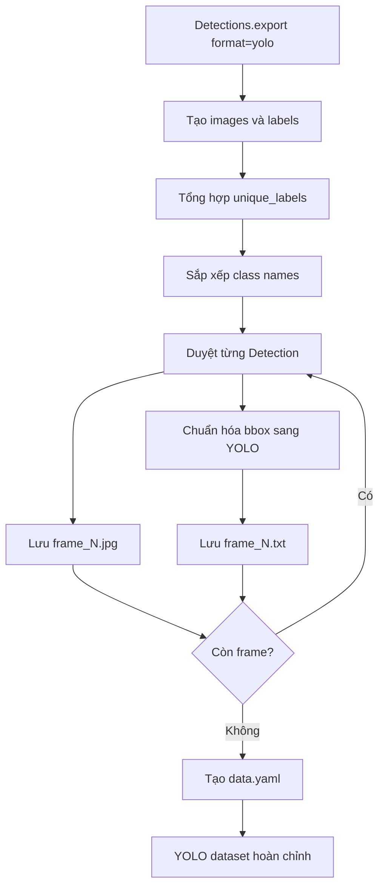
```mermaid
flowchart TD
    EXPORT[Detections.export format=yolo] --> DIRS[Tạo images và labels]
    DIRS --> CLASSES[Tổng hợp unique_labels]
    CLASSES --> SORT[Sắp xếp class names]
    SORT --> LOOP[Duyệt từng Detection]
    LOOP --> SAVE_IMG[Lưu frame_N.jpg]
    LOOP --> NORMALIZE[Chuẩn hóa bbox sang YOLO]
    NORMALIZE --> SAVE_LABEL[Lưu frame_N.txt]
    SAVE_IMG --> MORE{Còn frame?}
    SAVE_LABEL --> MORE
    MORE -->|Có| LOOP
    MORE -->|Không| YAML[Tạo data.yaml]
    YAML --> DATASET[YOLO dataset hoàn chỉnh]
```

## 21. Archive workflow

```mermaid
flowchart TD
    CALL[archive operation] --> VALIDATE[Pydantic validator]
    VALIDATE --> DETECT[detect_format]
    DETECT --> FORMAT{Archive format}
    FORMAT --> ZIP[ZipBackend]
    FORMAT --> TAR[TarBackend]
    FORMAT --> GZIP[GZipBackend]
    FORMAT --> SEVEN[SevenZipBackend]
    FORMAT --> RAR[RarBackend]
    ZIP --> OP{Operation}
    TAR --> OP
    GZIP --> OP
    SEVEN --> OP
    RAR --> OP
    OP --> COMPRESS[compress]
    OP --> EXTRACT[extract]
    OP --> LIST[list / search]
    OP --> VERIFY[test / verify]
    OP --> MODIFY[add / remove]
    OP --> TRANSFORM[merge / split / convert]
    MODIFY --> SUPPORT{Backend hỗ trợ?}
    TRANSFORM --> SUPPORT
    SUPPORT -->|Có| RESULT[Kết quả archive]
    SUPPORT -->|Không| UNSUPPORTED[NotImplementedError]
```

## 22. Dataset workflow

```mermaid
flowchart TD
    SOURCE[Dataset folder hoặc ZIP] --> EXTRACT{Archive?}
    EXTRACT -->|Có| TEMP[Giải nén tạm]
    EXTRACT -->|Không| ROOT[Dùng source trực tiếp]
    TEMP --> FIND_ROOT[Tìm dataset root]
    ROOT --> SCAN
    FIND_ROOT --> SCAN[Quét images và labels]
    SCAN --> OP{Operation}
    OP --> PARTITION[partition / repartition]
    OP --> SPLIT[split]
    OP --> MERGE[merge]
    OP --> REMAP[remap_classes]
    OP --> INFO[get_dataset_info]
    PARTITION --> ASSIGN[Phân bổ train / val / test]
    SPLIT --> ASSIGN
    MERGE --> CONFLICT[Xử lý class và tên trùng]
    REMAP --> LABELS[Viết lại class ID]
    INFO --> STATS[Thống kê ảnh / label / class]
    ASSIGN --> OUTPUT[Dataset YOLO]
    CONFLICT --> OUTPUT
    LABELS --> OUTPUT
```
